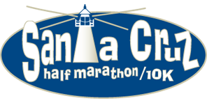

The 1/2 marathon distance of 13.1 miles can be very daunting. Maybe not for everyone, but it sure is for me. Perhaps this is a sign that this is not the distance I should be running. :)

Last year, my co-workers convinced me to sign up for the San Jose Rock 'n Roll 1/2 Marathon. At the time I signed up, I don't think I'd ever run more than 4.5 miles. What was I thinking?! I started increasing my distance weekly and even signed up for a 10k race in August to prepare for the 1/2 in October.  I did better than I expected in the 10k, so I started feeling better about running 13.1.

Unfortunately, for 2 weeks before the race, I was unable to run due to the flu and a nasty cold. I felt under prepared and was also still slightly sick on race day. In the end, I finished in under 3 hours, which was my main goal but overall, I wasn't very happy with my performance.

This year, I faced similar challenges in my training for the Santa Cruz 1/2. The first obstacle was a two-week business trip with limited access and time to run. The second, and biggest, obstacle was laparoscopic surgery 6 weeks before the race.

I decided to stick with it anyway and just go run it for fun. I even convinced Kimmy to run with me. I am really glad I did - this is one of the most beautiful races I have ever run. Actually, stopping for photos probably didn't help our time, but the photos were worth it.\[gallery type="rectangular" ids="314,312,311,310,307,308,306,305,313,317"\]

We started out strong and kept a good pace for the first mile. After that, I wanted to do 2/1 intervals. Unfortunately, parts of the course were hilly and I was having trouble. Then I started having some cramps...sometimes I think my body hates me.  I mean, c'mon, why did I have to get serious menstrual cramps right in the middle of a 1/2 marathon??!

Towards the end I was feeling better, but by then my feet were killing me. I broke my left ankle 5 years ago (and have three screws to prove it!) and now, any distance > 7-8 miles really kills my feet.  It's one of those "the more you do it, the less it will hurt", but I just don't run that far often enough.

Kimmy was quite the cheerleader, and really kept me going when I wanted to die.  I think other people would probably laugh at our conversations, but it was so enjoyable to me.

"Wow, we've done 4 miles!  Isn't that awesome?!"

"No, it means there's still 9.1 more miles to go.  Can I die now?"

We even ran through a horse farm, and right past a cute little goat.  In the end, no one died, and Kimmy and I made it and got our medals.

But our day didn't end there.  After the race, Kimmy and I headed to Saturn Cafe, a neat vegetarian restaurant in Santa Cruz, where we ordered waaaaay too much food.  But it was all so yummy!
