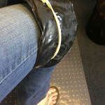

...5.75 miles last night. My race pace workout. My most daunting workout of the week, as I have to run increasingly longer distances at my race pace, which is faster than I would run if I wasn't pushing myself.

The first 4 weeks is 3 x 3000 meters w/ 800 meter recovery jog (walk!), and until last night I didn't think I would be able to do this. I'm not there yet, but I've been using these 4 weeks to work up to it. Last night, I did 3 x 1.5 miles w/ 0.5 miles recovery (so about 2400/800 meters). And I did it. I didn't die. I actually felt great when I was done!

Today, my knee hurts a bit, but nothing an ice pack (and an iPhone cable) can't fix!

