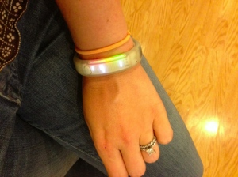

Last year, as a Christmas present to myself, I bought a Nike+ FuelBand. One of my co-workers/friends had one, and I thought it was a really neat idea.

I had never been interested in activity trackers like this before. I mean, of course I track my runs and such, but just general activities?  A pedometer?  The Nike+ FuelBand, though, is different from your average pedometer.  Each day you get a score, called "NikeFuel".  This is Nike's proprietary translation of your activity into an arbitrary, comparable number.  Here's what Nike says about it:

> NikeFuel counts all the activities of your athletic life. Running, walking, basketball. Nike+ devices measure your moves and turn them into NikeFuel. And since NikeFuel is calculated the same way for everyone, you can compare and compete with anyone.

Soon after I got mine, my boss also got one.  We had quite fun competing and challenging each other while on a business trip in Romania. I loved setting a goal and seeing the trophies (in the Nike FuelBand app on my iPhone). Nike+ FuelBand has encourages you to keep a "streak" going -- consecutive days of hitting your goal. These things make it quite addictive.

However, I started to notice that the FuelBand tracks activity that I don't think should qualify. On our business trip, my boss was trying to game the system by wearing it on his dominant hand while driving, writing on a whiteboard, etc.  Just shaking your arm will earn you some NikeFuel.

As you can see, I have mixed feelings about it.  Here's a short pros and cons list.

Pros:

- decent battery life
- motivation to meet / exceed goals through trophies and streaks
- fairly accurate steps/mileage calculations (it's at least consistent)
- has a clock - which means it can function as a watch too
- comfortable to wear 24/7

Cons:

- terrible app UI and website UI
- buggy app (at least on iPhone)
- excessive "NikeFuel" earned with little energy expended
- no sleep tracking
- the white one quickly looks grungy/dirty

Coming soon -- Fitbit Flex review!
