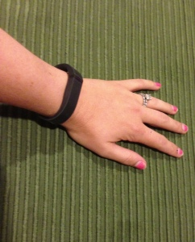

You may recall my recent review of the Nike+ FuelBand. Well, after using the FuelBand for several months, I decided to switch it up and try the Fitbit Flex.

The Flex didn't exist when I purchased my FuelBand, or I might have started with it. I originally looked at both the FuelBand and the Jawbone UP, before deciding on the FuelBand. I did not consider any of the existing Fitbit models at that time, because I was specifically interested in the wearable aspect. No forgetting it in a pocket or attached to the clothes I wore yesterday for this girl!

My husband has had a Fitbit for awhile and was very happy with it, up until my dog ate it (oops). He wanted a replacement, and I thought it would be fun to get the Flex, so we could compete. Turns out, I win. This should not be a complete surprise. (And not just because he forgets to wear his a lot.)

Overall, I think the Fitbit Flex is very solid. It's very comfy and it's nice that there are cheap-ish replacement bands in a variety of colors. You're not stuck with one color, like you are with the FuelBand.

The Fitbit app, at least on iOS, is also higher quality, although it too has its bugs. One thing I love about it is that opening the app on my iPhone triggers a sync. This is way better than the FuelBand, where you have to press and hold on the button on the band and even then sometimes you need to do it a few times.

What I really dislike is that there's no low battery warning. Sometimes I get an email, but I don't know what triggers that. I'm assuming a sync when the battery is below some threshold. If you don't sync often, you'll be out of battery without any warning. Another related complaint is that I have to take the tracker piece out of the wrist band to charge it AND I need the special charging cord (that's like a tiny cradle). The Fuelband which can plug directly into USB is much easier, no scrambling to find the charging cord.

Another thing worth noting is that Fitbit lacks the motivational aspect got me hooked with the Nike+ FuelBand. Sure, you have a goal, and yes, there's a leaderboard to compare against your friends. But the goal can change whenever you want, and there's no historical tracking of whether you met your goal. If I change my goal to 100 steps right now, and look at last Tuesday (when my goal was 10,000 steps), it will show the completed/not completed state based on the current goal of 100.

The leaderboard also only shows a 7-day step total vs Nike+'s today, yesterday, this week, last week.

Again, here's my list of the pros and cons.

Pros:

- decent battery life
- fairly accurate steps/mileage calculations
- comfortable to wear 24/7 (even better than the FuelBand)
- can change color of wrist band
- sleep tracking

Cons:

- no low battery indicator on wrist
- charging cord required
- no motivators
- no historical tracking of goal or goals met

_PS. I was not paid to write this review (or the Nike+ FuelBand review), and all views are my own. Just in case you were wondering._

**update: the band for my Fitbit Flex just broke. It's still functional but it's coming apart at the point where it flexes when getting the tracker in and out to charge. I will post an update once I see how they handle this -- Nike sent me a new FuelBand via next day air when mine broke after only 3 months.**
