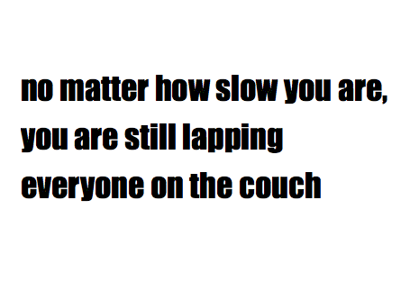

Lately, I feel there's been a lot of talk about my generation (gen y) ruining competitive running. One prime example is this article, The Slowest Generation, over at the Wall Street Journal.

These days, a runner can choose from the Rock 'n' Roll marathon series, runDisney, and scores of others called "fun runs". I ran the San Jose Rock 'n' Roll 1/2 marathon last year, the Disneyland 1/2 and two "fun run" events (the Rave run, and the Color Me Rad 5K, both completely untimed) this year.

There are also still a lot of highly competitive running events, like the Boston Marathon, and many ultra runs like the Badwater Ultramarathon.

Do I call myself a runner? Yes. Do I have hopes of being a competitive elite runner? No. Does this mean I shouldn't be called a runner? Just because I'm not out running a BQ, does that mean I shouldn't participate in race events? I think Kevin Helliker, the author of the article linked above, would say yes.

He probably hates quotes like these:

Personally, I feel anything that motivates us to get up off the couch and out on a run is great. Why not have a fun 5K where you get blasted by color? Why not be cheered by crowds and entertained with music as you run 13.1 or 26.2 in the Rock 'n' Roll series races?

I think the untimed "fun runs" are just that. FUN. Of course there are times to be competitive, and go for the all out win. As a person who runs for fun, for exercise, and to get outside, I'm never going to run a BQ. There's nothing wrong with that.

Shouldn't there be a way for Americans to have these fun runs and still keep the competitive side of running? Isn't that actually the point of the BQ? To keep it competitive and to keep out the riffraff like me?

Am I missing something?

I can't explain why America hasn't won an Olympic Marathon medal since 2004. I don't know why other people run, or don't run. Maybe these people should spend more time looking into that, instead of complaining that more and more Americans are getting off the couch and participating in endurance events like Color Me Rad.

Is this really a choice between a country with a few endurance athletes who compete in the Olympics and everyone else stays home on the couch versus the same or fewer endurance athletes but more Americans getting off the couch and out running as part of the "parade"?

I have to say, I'd rather be a part of the "parade" at races, trailing behind the elite athletes, than at home on the couch thinking that just because I can't run a 6 minute mile (or even close), that it means I'm not runner or can't run.  Because I can, and do.
