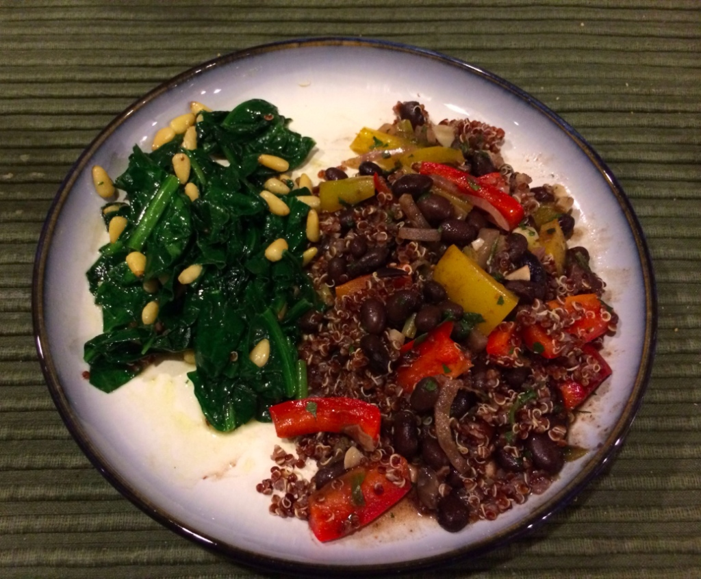

It's been a long time since I've posted a recipe. I started a 2 week gluten-free challenge on 9/29 and it's been tough coming up with veggie AND gluten-free dinner ideas that my hubby will like.

Anyway, he gave this one the thumbs up!

black bean and bell peppers w/ quinoa

- 2 bell peppers (I chose red and yellow but any color will work)
- 1/4 - 1/2 Red onion
- 1 can black beans
- 1 cup quinoa
- 1 bunch green onions
- 4-6 cloves garlic
- 1/2 - 1c cilantro
- chipotle powder, salt, and lime juice to taste

Directions:

1. Prep the veggies: Chop the bell pepper into bite size pieces and then do the same with the red onion and green onions but slightly smaller. Mince the garlic and chop up the cilantro now too.
2. Cook the quinoa according to directions.
3. While the quinoa is cooking, sauté the bell pepper, onions and garlic with olive oil.  Add in the chipotle power and lime juice now. Salt to taste.
4. When the veggies are almost done, add in the black beans and heat until bubbly
5. Add cilantro at the end and adjust seasoning if needed
6. Serve either with the black beans and bell peppers on the side, or mix with quinoa.

Notes:  You can see from the photo that I used red quinoa. Any will work! I served this with a side of sautéed spinach, but that's just because it's what I had handy. Also, I meant to add diced tomatoes and forgot. Corn would also work well in this dish, as would some vegan cheese on top. I left it off this time as my husband is not a big fan of the cheeze.
