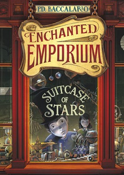

The English translation of this children's fiction novel is due out in March of 2014. I was lucky enough to get a (free) digital copy in advance through NetGalley, in exchange for fair and honest feedback. It's a fun, quick read.

Suitcase of Stars tells the story of how Finley comes to meet the Lily Family, and the story of the Enchanted Emporium. The emporium is a store full of magical items, and ownership of the store has been rotating between seven families for centuries.

Finley and his dog Patches make quite the pair in this fun, magical adventure story. The writing is solid and the main characters are fairly well done. I would have liked to learn more about Ailby Lily and her father. I feel like there could possibly be enough material about them to make a sequel. Finley gets the most attention, almost too much, with the beginning of the book being a little slow. It picks up at the end though!

My only complaint about the novel is that it's billed, somewhat, as a mystery novel.  In that regard, I feel it's a let down. To be honest, Finley saves the day at the end, but from who and why? There's some parts that just don't add up at the end. What was the involvement of Mr. Everett? Why was Unther Farla there? Is the reader supposed to link the two based on Everett's mention of being asked to assist as an interpreter?

All in all, this was very enjoyable to read, and I would certainly read more if there were a sequel or series with these characters in the future.

★★★★
