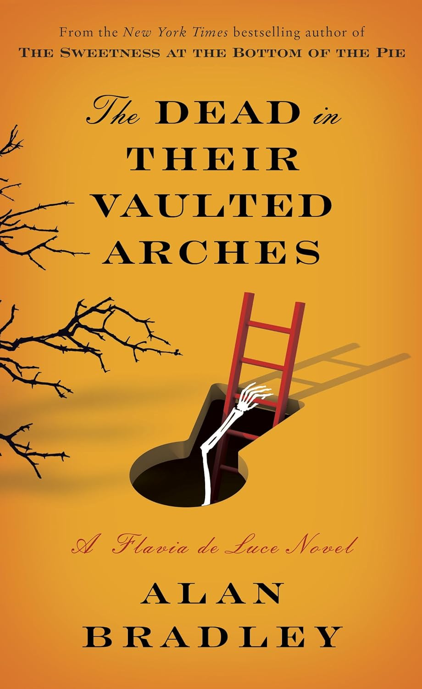

_The Dead in Their Vaulted Arches_ by Alan Bradley is the 6th book in the Flavia de Luce mystery series.

In general, I find mystery novels hard to review without giving away too much of plot. This is doubly so for Flavia's 6th murder investigation.

11-year-old Flavia Sabina de Luce is one of my favorite protagonists. She is the youngest of three sisters, and lives in a mansion, where she has taken over the chemistry lab of her dearly departed Uncle Tar. When she is not experimenting with poisons in the lab, she is out sleuthing for clues to the latest murder in Bishop's Lacey, the quiet English village where the de Luce family resides.

If you haven't read any of the series, I highly recommend you start with The Sweetness at the Bottom of the Pie, the first in the series. From here, you will follow Flavia on her journey and come to know the de Luce family, as well as many others from Bishop's Lacey, and the surrounding towns.

_The Dead in Their Vaulted Arches_ is one of the best yet. This novel propels Miss Flavia into a new chapter in her life, and illuminates some of the mystery surrounding her mother Harriet's disappearance.  I am eagerly awaiting the next in the series, to see what future awaits for dear Flavia Sabina de Luce.

_Disclaimer:  I received an advance copy of this through NetGalley, in exchange for a fair and honest review._

★★★★★
