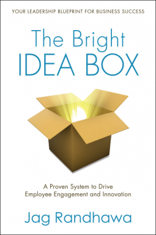

_The Bright Idea Box_ is a very different type of book compared to what I normally read, so I wasn't sure what to expect when I started reading this.

Jag Randhawa presents a system to encourage and empower employee driven innovation. There are many real world examples, from Toyota, 3M and of course, Google. There are also numerous how to's and checklists to get you started.

The premise is that bottom-up innovation needs to be nurtured and encouraged, and that doing so will also increase employee engagement, a win-win for most companies.

I found this to be an easy read and a good introduction to the topic. However, I was left at the end with a feeling like I wouldn't quite be ready to start something like this at work without furthering reading and research.

_Disclaimer: I received a free copy of this through NetGalley, in exchange for a fair and honest review._

★★★
