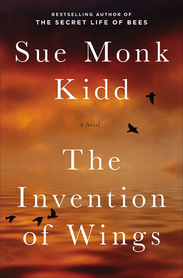

If I hadn't read and loved _The Secret Life of Bees_ by Sue Monk Kidd, I don't know that I would have picked up _The Invention of Wings_. In all honesty, I probably wouldn't even know this book existed. However, I am so so glad that I do.

Set in the early 1800s, the novel follows the Grimké family, a wealthy, slave-owning family in Charleston.  For her eleventh birthday, Sarah Grimké is given ownership of Hetty "Handful" Grimké, a ten-year-old slave.  Hetty is to be Sarah's handmaiden, whether either of them like it or not.

> Let not your heart be troubled. Neither let it be afraid.

The novel alternates between Sarah's point of view and Handful's. Often, I find this kind of writing style to be poorly done and hard to follow, but not so in this case. I don't think I was ever unsure of who's POV it was at any time, and I felt each had their own voice.

This book provides a rich history and view of slavery and slave-owning families of the early 1800s. Personally, I often have found it hard to imagine what it would have been like to be alive during this time of America's history, and _The Invention of Wings_ has really allowed me to finally see.

> To remain silent in the face of evil is itself a form of evil.

Would I have been as courageous as Sarah or her sister Nina? Or would I have been more like their mother or their sister Mary? I would hope I would be more like Sarah and Nina, and stand up for both myself and women's rights as well as the cause of the abolitionists.

I mistakenly purchased the Oprah's Kindle version of this book, and I highly recommend that you avoid it, if possible. Oprah's notes are intrusive, and her commentary does not add one iota of value.

Before I read the novel, I had never heard of Sarah or Nina Grimké, or the Grimké family for that matter. As it turns out, this novel is based on and inspired by the real life events of Sarah and Nina Grimké. The author has taken creative liberties, including the invention of Handful Grimké, but points out in the author's note places where she has stayed true to history and places where she has strayed from real events.

> Be careful, you can get enslaved twice, once in your body and once in your mind.

This novel truly touched me, and it's one of those books that I want to share with everything. If you liked _The Secret Life of Bees_ or _The Help,_ then I strongly encourage you to read _The Invention of Wings._

★★★★★
