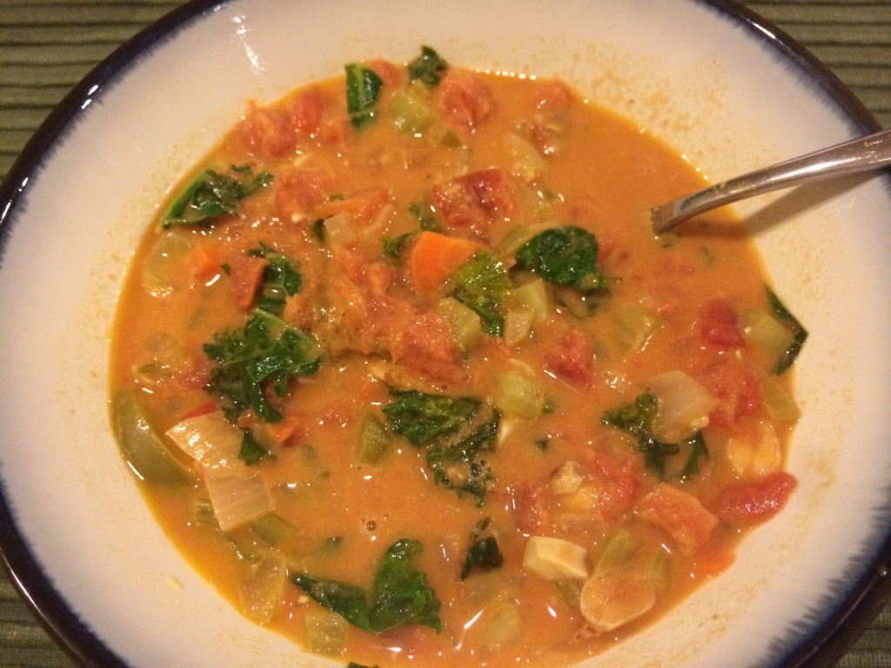

I found a recipe for african peanut soup by accident many years ago, and apart from the fact that it's veggies, tomato, and peanuts, I don't know how much of the original recipe is still here. Of course, I think it's delicious the way I make it, but feel free to experiment.

This is one of all my all time favorite soups, and it's extremely adaptable. My husband told me tonight that it's almost as good as Kraft Mac 'n cheese. That's huge, because he loves his Kraft Dinner (which I don't buy because I buy almost exclusively vegan).

_African Peanut Soup_ _serves 6 - 8_

Ingredients

- carrots (1-3)
- celery (3-4 stalks)
- yellow onion (red or white will work too)
- bell pepper
- garlic (to taste, I like about 6-8 cloves)
- petite diced tomatoes (28 oz can)
- kale or other greens (2-3 loose cups)
- peanut butter (1/2 c natural, chunky)
- peanuts (handful)
- salt
- pepper
- cayenne pepper or Parma! Chipotle (fresh minced serrano or jalapeño peppers would work too)
- cilantro or parsley to garnish

Directions

- Chop all the veggies and the garlic. I do a rough chop, but you can go smaller for a less chunky soup
- Sauté the celery, carrots, onion, bell pepper and garlic in olive oil. Just until the onion is soft is enough, because it will all cook more as we make the soup
- Add the canned tomatoes, including all the liquid
- I add my salt and pepper now, and the cayenne/Parma!  Roughly 1/2 tsp of salt and about 1 tsp pepper, and spice as you like
- Simmer for about 5 minutes
- Add peanut butter and 1-2 cups water, stir thoroughly
- Cover and simmer another 5-10 minutes
- Add in the kale and simmer (covered) until kale is tender, about 5 minutes (you may need to add more water here, it can get really thick if you started with 1 cup of water.  You can always add more later too)
- Add peanuts and add spice/salt to taste

You can use really any veggies that you like in this soup. I almost always use carrots and onions, but generally whatever I have on hand. Tonight was the first time I added leafy greens, and it really worked well. You can make less by using a smaller can of tomatoes of tomatoes and less of everything else. I don't really measure, I just eye ball it. You want about 1:1 ratio of tomatoes to other veggies not including the leafy greens, as those will cook down dramatically.

Here's what my cutting board looked like before I put everything in the pot (garlic not shown, sorry)! I only had one carrot, otherwise I would have used more carrot and probably less celery.

And here's what it looks like with everything added.  It looked OK in the pot, but once I served it, I realized it was too thick, and I added hot water to thin it out.

Other ideas:

- chili powder in place of cayenne
- coconut milk or soy creamer in place of water
- vegetable stock in place of water
- potatoes, sweet potatoes
- blended
- add soy sauce or tamari in place of some of the salt
