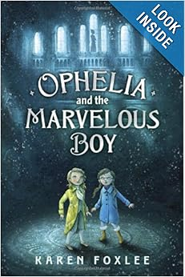

In this modern take on the classic Snow Queen fairytale, our heroine Ophelia finds a mysterious boy locked up in a museum. While her father is working, Ophelia struggles to understand why the boy is locked up, and how she can help him.

Unable to believe anything that can't be proven by science, Ophelia's world is shattered when she discovers the boy's truth and the world of magic and evil.

It's part story-within-a-story, as we learn of the boy's story in flashbacks, while Ophelia is trying to rescue the boy and free him from the Snow Queen. Ophelia's courage is put to the test time and time again as she faces challenge after challenge in order to save the boy and defeat the Snow Queen.

This is a fun, quick easy read, and highly enjoyable.

In the end, trust, friendship, and courage are triumphant over evil.

_Disclaimer: I received a free copy of this through NetGalley, in exchange for a fair and honest review._

★★★★
