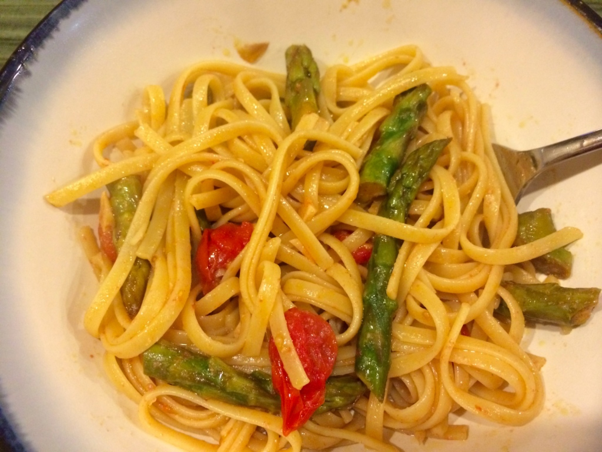

My husband and I both love pasta, but I try to not make it too often. While delicious, it's high in carbs and always seems better with cheese.  David loves a traditional marinara sauce, but I find that gets boring quickly.

Now, with this recipe, I have found that a vegan pasta dish can be just as delicious without the cheese or a thick marinara sauce.  And, it's super easy to make, and only takes about as long as the time to boil the water and cook the pasta!

**asparagus, tomato and garlic pasta**

Ingredients

- Linguine or noodle of your choice, enough for 2
- 5-6 oz cherry or grape tomatoes
- 1 bunch asparagus
- 3-6 cloves of garlic, minced
- olive oil
- 1/2 tbsp balsamic vinegar
- 1/2 tbsp sugar
- nutritional yeast

Directions

1. Pre-heat oven to 475 degrees and set water to boil for the pasta
2. Trim asparagus, add to a small glass casserole dish, along with tomatoes
3. Toss with balsamic vinegar, sugar, and olive oil (enough to coat), place in oven
4. Add the garlic to the dish in the oven when the water boils (assuming 8-9 minutes to cook pasta)
5. When pasta is done, remove veggies from oven, add to drained pasta, toss, and sprinkle with nutritional yeast to taste.

If you like balsamic vinegar, you can probably increase the amount and/or decrease the sugar/oil. David is not a fan of vinegar, and he finds this recipe tolerable. If it were just for me, I would probably double or triple the vinegar and use little/no oil.
