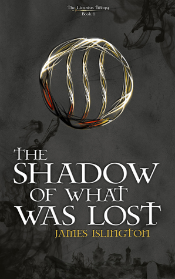

 _The Shadow of What was Lost_ by James Islington

I love, love, love a good fantasy novel. I started reading _The Magic of Xanth_ series by Piers Anthony when I was a teenager, and I have loved fantasy novels of all sorts ever since.

Some of my favorite fantasy novels and series include _The Sword of Truth_, _A Song of Fire Ice, Mistborn, Daughter of Smoke & Bones,_ and _Harry Potter._ Oh, and we can't forget _Lord of the Rings!_

I think fantasy is probably my favorite genre, and I while I read a lot of fantasy, I definitely don't read enough of  it! To give you an idea, my good reads account has over 1,000 books shelved, with roughly 500 read and 500 t0-read. I have more books shelved under fantasy than I do under non-fiction, and I read a fair amount of non-fiction. Apart from read, t0-read, and fiction, my fantasy "shelf" has the most books (and these are all included on the fiction "shelf").

So, after finishing _The Shadow of What was Lost,_ you can imagine my disappointment when I discovered that this was a newly published novel (the author's first!) and the remaining books in the trilogy have yet to be written.

In _The Shadow of What was Lost,_ we are introduced to a vast and unique world where the Gifted are oppressed and controlled by the non-Gifted. Artifacts of a long ago war, the Gifted are distrusted and ruled over by administrators and the King.

Davian, our main character, must learn to control the Gift, or else he will be turned into a Shadow, a class of people even more shunned than the Gifted. Setting out on an adventure, he travels through the lands and sets in motion events that will change his future, and the future of everyone.

 At first, I wasn't sure what I thought of the novel, but after 30-50 pages, I was hooked. I am eagerly awaiting the second in the trilogy, and in the meantime, I think I might finally start reading _The Wheel of Time_ series.
