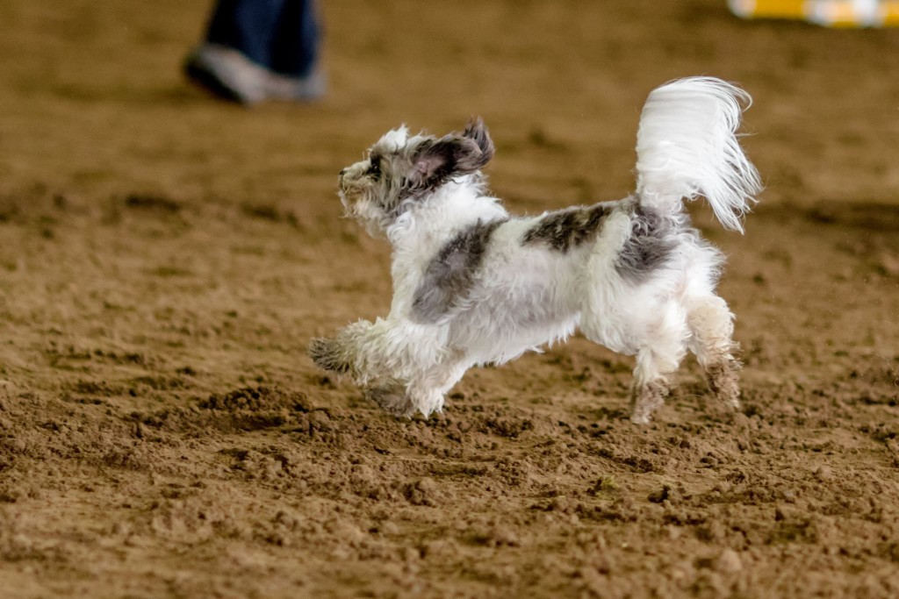

Last week I started a 12-week training plan for my next big race, the Capitola Half Marathon. It really helps me focus to lay out a training and commit to training.

I've used many different methods for creating my training plans, but I really had success using Greg McMillan's method that he outlines in his book You (Only Faster). The basic theory is that there are certain workouts that are better for achieving certain results AND there are also certain paces and certain workouts that are better for an individual person. The book walks you through how to take any of Greg's training plans (or any other plan -- you can find lots online for free and even more if you're willing to pay) and how to customize it for you.

This is what I did for the Capitola Half Marathon last year, and I had my first PR for the half marathon! And this was despite having to walk the last 3 miles due to my stupid ITBS.

I'm excited to get back into training for a race and running more regularly. For the first week, I ran only 8 miles, but a nice slow steady start is good to prevent injuries! And this year I am going to make sure that at least 2 of my long runs are 10+ miles, so the distance will definitely increase over the 12 weeks of the plan.

Last year, my longest training run was around 7 miles, and while I had been pain-free while running, it hit me around mile 10 during the race. It was so bad, actually, that I almost quit the race. Then I looked at my GPS watch and realized that even if I walked the last 3 miles, I could have a new PR for the half marathon and that was just the motivation that I needed. I'd rather not do that again though.

Even Roxy is excited about training, she's looking forward to joining me on some runs! And boy, that dog can run!

**Anyone else training for an upcoming race? What method do you use?**
