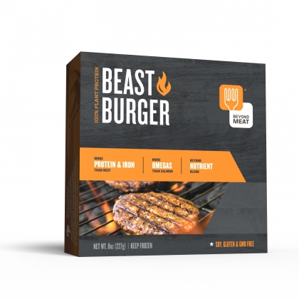

Beast Burgers: 260 calories, 23 g of protein. They are also: Gluten-Free, Soy-Free, Cholesterol-Free, Non-GMO.

When I recently made my first Beast Burger purchase at Republic of V in Berkeley, the cashier made a comment about how much these were like McDonald's hamburgers. I almost put them back and didn't buy them because of that comment. I don't eat veggie burgers because I miss meat, I eat veggie burgers because they are a good source of protein! And I never liked McDonald's hamburgers. In fact, I think the last time I had one was probably around 1997 and I felt sick for the entire day after eating it.

I am so glad I did not put these back. These are tasty and packed full of protein. My veggie burgers are usually eaten bun-less with a side of mustard, so they have to be good. No hiding behind a carb-filled bun in this house!

Oh, and the website says beast burger "features the Beyond Nutrient Pack™ which aids in muscle recovery" ... I may have just found my new go-to food for post run recovery. The last really high protein burgers I tried were Dr. Praeger's from Costco, and I really hated those. These are much better, I just hope I can find them locally.
