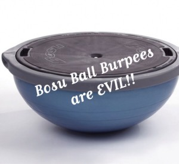

This morning was my 8th week with my personal trainer.  :)

I have never been good at strength training on my own, and the thought of lifting weights by myself with no guidance is a little scary. However, I know it's important as part of a comprehensive fitness plan and one of the best things I can do to boost my metabolism and accelerate weight loss. So, I signed up for a membership at my local gym and inquired about trainers.

So far it's been fun, and I've realized that there is a lot of strength training you can do at home with little to no equipment. And the weight machines aren't that scary. It's not all dead lifts and bench press!

When I started out, the trainer I was working with focused mostly on exercises that can be done with kettle bells, dumb bells, or resistance bands. After 3-4 sessions, her schedule and mine weren't working out, and I got a new trainer. I'm still doing tons of squats and lunges, but now I am also learning to use the squat machine and a lot of the other machines.

Last week, I did lunges and squats while holding a medicine ball (15 lbs). Some sets involved doing a chest press with the ball and others a shoulder press. What a way to work the upper body into squats. This was not my idea fun!!!

This week, we did a total body workout using the Bosu ball. Before today, I had never, ever, in my life done a burpee. I'm sure they are hard the normal way, but let me tell you - try doing it on a Bosu ball!

Here's a few of the other things I've done:

- squat jumps with the TRX machine
- lat pulldown & reverse grip lat pulldown
- reverse grip tricep pushdown
- leg press
- lunges, reverse lunges, lunges with twist, lunges with medicine ball, lunges until your legs are burning and feel like jell-0.....
- Bosu ball mountain climbers
- squats, squats, squats

Luckily, my broken toe hasn't affected my ability to meet with my trainer, but it has made running impossible. While I'm waiting for the toe to heal, I've tried to squeeze in some yoga.
