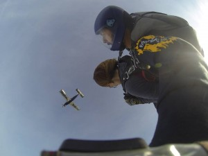
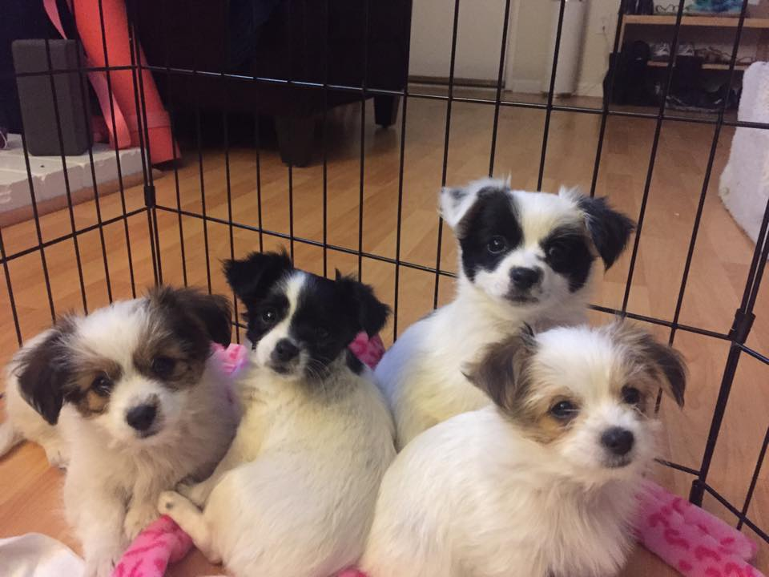

2015 went by really slowly and really fast at the same time. It seems like only yesterday I was moving out of my house in Santa Clara and into the house I rented in San Jose, yet that was a year ago.

 A lot happened in 2015. I sold my house in Santa Clara, got divorced, rented a house, bought a house, moved twice, ran a 1/2 marathon, went to the opera for the first time, went skydiving for the first time, and many other things.

Looking back, I didn't outline any concrete goals for the year. However, my goals for previous years have centered around health, running, Spanish, and reading.

Health-wise, I had a good year. I lost some weight, gained some muscle, joined a gym, went to see a personal trainer for a while. Now I just need to stick with it. The last month has been tough with the holidays and the horrible cold that I've been fighting.

On the running front, it was both good and bad. I set a new personal record for 1/2 marathon distance, and ran an amazing 10k that was not a PR but great because I had horrible stomach pain and walked a lot but was only 20 seconds behind my best time. However, I ran almost exclusively on the treadmill, and I ran only 236 miles. This is 75 miles less than the previous year. Partially, it's due to moving and being sick. It doesn't help that I haven't figured out a place for my treadmill since moving.

Some day I will finish Fluenz Spanish 3-5. There was a month where I was dedicated, but I got distracted and didn't get back to it.

One goal that I did make was a goal to read 65 books. I didn't make that goal, and only read 55. However, I did read some really long books (Like Stephen King's _Under the Dome_). 

For 2016, here's some things I'd like to focus on:

running - SF 1/2 Marathon in April; PR will be challenging because of the elevation gains on this course; run at least 300 miles for the year, preferably 400+

reading - more non-fiction and/or classics this year; 10 non-fiction and only one classic last year; I'd like non-fiction and classics to be at least 25% of my reading

Spanish - finally finish Fluenz level 3 and try to finish level 4

health - more yoga, get a strength training routine and stick to it

volunteering - now that I own a house again, I'd like to foster more often for Jake's Wish Dog Rescue, a non-profit dog rescue that I work with regularly.

