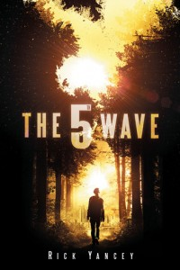
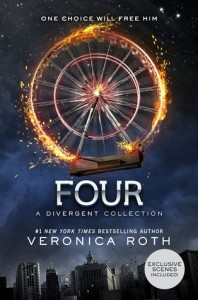
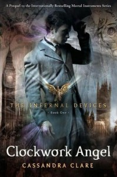
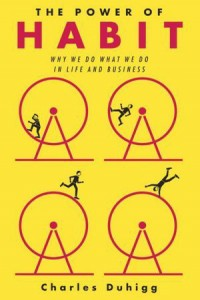

With all the books I read, I've found that I don't find time to write a detailed review for each book. However, grouping a bunch of mini-reviews together was successful last year, and I think for 2016 I will try to do that more often.

So here goes.

_The 5th Wave_ by Rick Yancey - 4 stars

genre: young adult; sci-fi; post apocalyptic/dystopia; aliens

This book will probably appeal to readers who enjoyed The Hunger Games and the Divergent Trilogy. I loved those books, and this was just as good.

The twist here? It's an alien invasion. I hadn't heard of the series before, but it's already coming out as a movie this weekend. I'm looking forward to seeing the movie and continuing to read the other books in the series.

_Odd Thomas_ by Dean Koontz - 4 stars

genre: horror; thriller; supernatural/paranormal

I've been meaning to read this book forever. It was one of the first books I added to my list when I created my account on goodreads.com.

Odd Thomas reminded me somewhat of The Dead Zone by Stephen King, although Odd was born with his abilities. The nature of his abilities are also different from Johnny's, but the premise of fitting in and coping with the side effects of these abilities while trying to do good are where the similarities arise.

Entertaining enough that I will check out the movie that came out a year or two ago, but I'm not sure if I'll read more of the books in the series.

_Four: A Divergent Story Collection_ by Veronica Roth - 3 stars

genre: young adult; sci-fi; post apocalyptic/dystopia

A collection of stories from Four's point of view, mostly consisting of events preceding the time covered by the main trilogy. Great for Divergent fans, but probably not interesting to any one else. I was hoping for more.

One thing I will mention is that I did feel the writing was stronger and much improved over Allegiant.

_The Fix Up_ by Tawna Fenske - 2.5 stars

genre: contemporary romance

I really enjoyed another book of hers, About That Fling, so I thought I would give this one a try. I really didn't care for this one, I found it a bit ridiculous and absurd. But maybe that's how modern romance novels are supposed to be? I don't read a lot in this genre, so I'm not sure if this is typical fare or not.

_The Infernal Devices_ (trilogy) by Cassandra Clare - 4.5 stars genre: young adult; supernatural/paranormal; historical fiction

A prequel to The Mortal Instruments series. I loved these books, and hated that it had to end.

This series takes place at the London Shadow Hunter's Institute, circa 1878. In it, we meet ancestors of Clary, Jace, and Isabelle, and learn more about Magnus and his history with Camille.

The downworlders (vampires, faeries and werewolves) don't feature as prominently in this trilogy, as the Shadow Hunters are faced with a different threat. Don't worry though, it's still action packed like the original series.

_Warheart (Sword of Truth, #15; Richard and Kahlan, #4)_ by Terry Goodkind - 4 stars

genre: fantasy

I think this is the final, final Sword of Truth book. Many people felt the series went downhill, and while I agree, I was happy to see a good ending.

I'm still waiting to find another epic fantasy series like this. Game of Thrones is close, but very different. The Sword of Truth series was always focused on the battle(s) against evil, and GoT, well, everyone has an evil side it seems. 

_The Power of Habit_ by Charles Duhigg - 3 stars genre: non-fiction; psychology

It's really interesting how much our habits drive us, and how much of what we do is actually just a habit. There's a lot of great insights in this book on how habits are formed, and how you can manipulate a bad habit into a good one.

I would have rated this higher, but there wasn't a lot of science, just some observational information and a few tidbits from research.

_The Lunar Chronicles_ by Marissa Meyer - 5 stars genre: young adult; sci-fi; fantasy

This series was amazing. I am not a Twilight fan (saw the first movie, didn't read the books), so this surprised me. The first book, _Cinder,_ centers around a teenage girl who happens to be a cyborg. Oh, and her back story is reminiscent of Cinderella, hence the name Cinder.

It's post-apocalypse, fun, and entertaining. Oh, and there's aliens too.

 

Up Next: I'm currently reading Crime and Punishment by Dostoyevsky, and Half Broke Horses by Jeannette Walls.
