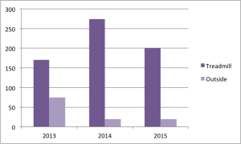
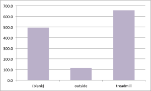

2013 was the first year I had my own treadmill. I ran 170 miles on the treadmill and 75 outdoors (not counting races). I started recording all my runs and keeping good data in 2011, but it wasn't until 2013 that I started tracking based on treadmill vs outdoors. My best recollection is that I ran a moderate amount (maybe 50% of my mileage) on the treadmill at my apartment complex in late 2008 - 2009. In 2010, I moved into a house, and treadmill runs from then until 2013 were a rare occasion, usually only when I was visiting my mom and used her treadmill.

The chart below breaks down my miles over the last three years. 

When I first got the treadmill, I was thrilled. Here was my opportunity to really rack up the miles, able to run any time, regardless of the weather. Yes, I know I live in California, and it's almost always running weather. The real challenge for me was daylight. I don't like running after dark or late at night, outside, alone. I could invest in a headlamp, but at the time, my longer runs were on a public trail that was some what secluded, and I felt that it was safest to stick to daytime running only outside. Oh, and there's TV watching. If I'm going to spend time sitting on the couch watching TV, why not do that while running instead?

I also thought the treadmill would come in handy to really ramp up my speed. On the treadmill, you know what speed you're running and you can easily make it faster or slower, and the same with incline. Those things come in handy, but how well does that translate when running outdoors?

Treadmill running is great for intervals. I can see my time and speed exactly, and I can adjust the speed at each interval easily. When running outside, I haven't learned how to adjust my speed as precisely. However, what I'm learning now is that maybe it should be less about running at an exact MPH and more about perceived level of effort. 

After running many miles on the treadmill, what I've discovered is that I think it's actually harder and it's not helping me get faster. I've been so locked into certain paces on the treadmill (and the 1% incline to counter the lack of air resistance), and while doing tempo runs or intervals, I've pushed myself, most of the treadmill runs are "easy runs" and always at the same speed.

Recently, I've started running outside again, and what feels the same as that "easy run" on the treadmill turns out to have a lot of variation in the speed, but overall, ends up faster. I've also noticed that after running on the treadmill a lot, I tend to forget to use my leg muscles, which is super essential for outdoor running, and racing in particular. The problem is that after so many miles on the treadmill, it's become a habit, and one I'm going to have to work hard to break. Once I remember and continuously remind myself to push with my legs, I'm a lot faster outside. 

Now that I've assembled my treadmill at my new house, I tried to use it. And I hated it. I felt forced into a speed, kept stopping, and faced a severe lack of motivation. Then I went outside, and the same type of run seemed easy, and when I was done, I discovered my pace was 2 minutes per mile than what I had anticipated.

Here's a look at all my running data since 2011. You can see I've logged quite a few miles on the treadmill.

Will I give up on the treadmill completely? Probably not. It still has its uses, but I'll be making a shift to run most of my miles outdoors. I really love running outside and I think it will help me achieve my goals this year.

What do you think? Is treadmill running easier or harder than running outside? Is it better or worse for your speed / form / body?
