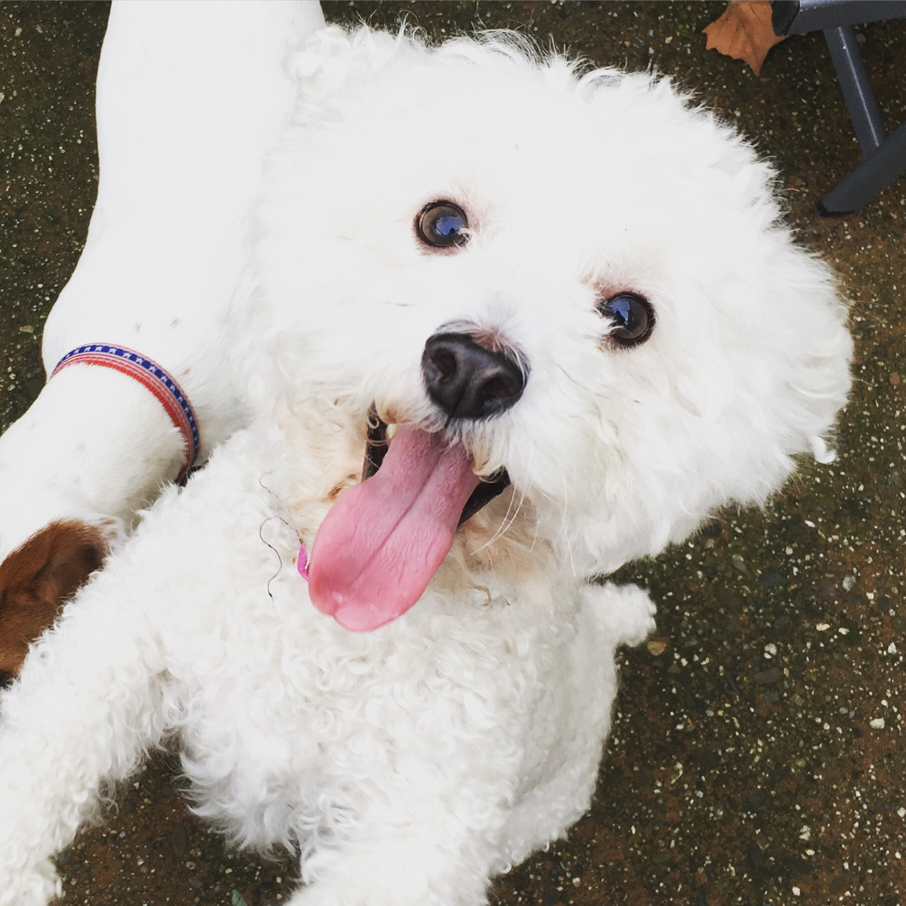

Ever wonder if there are really easy things you can do to be happier? There's a lot of research around happiness lately, and not just _The Happiness Project._ I've read a few books on the topic and I find it fascinating.

I came across an article awhile back that had a list of 10 simple things you can do to be happier, and I thought I'd share. (Unfortunately, the website doesn't seem to have the article online anymore, so no link!)

 

\[caption id="" align="alignnone" width="360"\] fostering dogs and volunteering with Jake's Wish makes me happy!\[/caption\]

  The list is:

1. exercise more
2. sleep more
3. commute less 
4. spend time with loved ones
5. go outside (especially at 13.9°C)
6. help others (100 hours/yr)
7. practice smiling
8. plan a trip but don't take it
9. meditate
10. practice gratitude

I definitely do most of these already, but I haven't practiced smiling, and it's been years since I planned a trip and didn't take it.  Oh, and I huge kick in the butt to get back on track with meditation.

What do you do to be happy?
