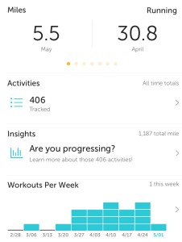

Every time I sign up for race, I come up with a training plan. I've done this since my first 1/2 marathon, and I did it then because I really had no idea what I was doing without a plan, and thought I needed the focus of having a plan. Without it, I don't think I would have finished the 1/2 marathon.

There's a plethora of training plans online, and as well as many books on the subject. It can be quite daunting to select a plan. One thing I found particularly challenging was finding a plan that didn't involve running 4-5 days a week with extremely high mileage. Yes, I understand that a 1/2 marathon requires putting in some miles. :) But I didn't want to kill myself doing it.

When selecting a training plan the first time around, I really didn't know what I was doing. I was so overwhelmed by the choices, but I found Greg McMillan's website to be very informative and a personalized plan wasn't very expensive, so I went for it. I loved that his plans were mostly time based and not mileage based and my personalized plan worked out well. I have used his plans as a baseline ever since.

Recently, I've started to feel that my training isn't getting me where I want to be. I know a huge part of this is consistency, as I will often stop running for weeks, sometimes because of travel or illness or just a lack of time.

Here's a good example:

As you can see, I didn't run very much at the end of February and the beginning of March. I have a really good excuse though, I had a 102 fever and a horrid cough. Since then, I've done a good job of running at least 3 times a week, consistently.

I'm also curious to see if running based on target heart rate, and not a target pace will help. I've done mostly time based runs at a set target pace, and I'm not seeing the improvements I would like. My endurance is definitely better, but the speed improvements are very little. In some ways, I feel the target pace is holding me back, as I'm trying to hit that, when in reality, I could be running faster.

So far this year, about 1/2 of my miles have been outside. This is a big change for me, and I've noticed that when I set the pace based on what I feel is easy, I'm running faster than my target pace I would set on the treadmill. And not only does it feel good to run at the faster speed, it feels easier. I had one run on the treadmill last month where I felt I could barely run for a minute without wanting to stop and feeling completely out of it.

While writing this, it occurred to me that maybe I don't need a target anything. I should run however feels good on that particular day. If I'm aiming for a speed workout, something that pushes me, and for an easy run, whatever is comfortable.
