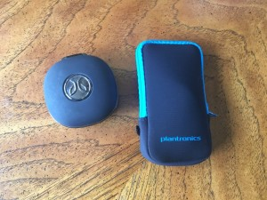

I love listening to music while I run, and for years I've run using basic Apple EarPods (the ones that come with iPhones). Overall, I love these as they are light, fit well in my ears, rarely come out, and don't cause any pain even when worn for hours.

However, I have one big issue with them - the wires! If my phone is in a back pocket, then I need to run the wires around somehow. This part isn't too challenging, but it seems no matter what I do, the wires get tangled with my necklace. Yes, I know I could take off the necklace when I'm running and I have done that in the past.

When I have my dog along, sometimes her leash will tangle with the headphone wires, resulting in a brief stop to untangle every one.

If I have layers on, I never remember to put my headphones on before the top layers.  This means that if it warms up and I need to remove a layer, it's quite an ordeal.  Not a huge problem for a training run, but once during a 5k race, I tried to do this while running and I'm sure it was an interesting thing to watch.

All of these issues prompted me to check out wireless bluetooth headphones.  There are many models these days that pair over bluetooth and this seemed like a perfect solution to my problems!

I have two pairs, Jaybird BlueBuds X and Plantronics Backbeat Fit. I've owned the BlueBuds for a few years but didn't like them enough to wear them all the time, which is a shame given that they were $$$ when I bought them. The Backbeat Fit headphones just arrived last week and I already love them!

## Jaybird BlueBuds X Bluetooth Headphones

\[gallery type="thumbnails" link="file" ids="1750,1752,1751,1754,1769,1768"\]

### The Good

Accessories Lots of ear tips and ear fins are included so you get a perfect fit (hopefully). Audio quality Good enough for me, but I'm not too picky as long as the sound is clear and even. Battery life I haven't really tested this out, as I charge them often and before long runs, but they hold a charge and haven't died on me yet. Comfort Fairly comfortable to wear for extended periods, with some caveats. Quality They seem well made and I haven't had any issues .

### The Bad

Price > $100 I paid a lot for these 3 years ago. They are no longer made but can still be purchased for about 1/2 what I paid. The newer model is also a lot less than the original price, depending on what color you want. In any case, the new ones are also > $100, which is a lot to pay for headphones Fit Even with all the ear tips and fins, I don't feel these fit well. They bounce and this causes some noise. If I put the strap in the back over my pony tail or finagle it in other ways, this reduces the bouncing but I haven't figured out how to eliminate it completely. This happens more so on the right side, possibly due to the controls being on that side. They also don't seem to stay inside my ear properly either. Accessories Having to keep track of the ear tips and fins is a pain... I am pretty sure I lost the extra ones. Noise In-ear style blocks a lot of ambient noise (this may be a pro for some, but when running outside, I like to be more aware of my surroundings). Style They stick out pretty far and look dorky. Case/Storage The case for these is cute, but it's a pain to get the headphones and the charging cable inside and have it close properly. Setup Figuring out which tips and fins to use was non-trivial for me (and I still don't feel I did it correctly). You can also install the fins differently and wear these so the cord goes around and over the ear. The directions were hard to follow, and I gave up trying to figure out how to wear them that way. 

## Plantronics BackBeat Fit Bluetooth Headphones

\[gallery type="thumbnails" link="file" ids="1762,1759,1760,1761,1770,1771"\]

### The good

Price < $100 Fit I just got these, so far I feel these fit very well. The cord is just the right length, and I don't feel they bounce around much at all. Audio Quality Great sound quality, nice bass. Battery life These should have an 8 hr battery life, same as the BlueBuds. Noise These are more like Apple's EarPods so while they do go in your ear they are not "in-ear" style that blocks out all ambient noise. Quality Lacking the ear fins that the BlueBuds have, these seem very sturdy and unbreakable. Style I feel these look a lot better than the BlueBuds! Case These came with a neoprene case that can also be used as an armband for a cell phone. The headphones and the charging cable easily fit inside.

### The bad

Comfort The part that goes over the ear feels like it will become uncomfortable during long runs, and might also be difficult to wear these with sunglasses for an extended period time. I haven't tried yet, but I will post an update once I do. 

### Summary

All in all, I like the Plantronics the best. I'm sure some will prefer the in-ear fit of the BlueBuds, however they just aren't for me. My mom also tried on both pairs, and she preferred the Plantronics as well. I'll find out this weekend how they do for a long run!

\*\*\*\* I did not receive any free products or discounts to write this review. Maybe someday I'll get free stuff in exchange for a fair and honest review??!
