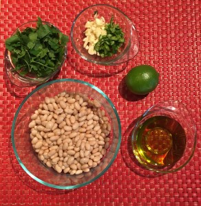

I'm hosting my book club tonight, and I decided to make hummus, bread, and avocado dip. I have always loved hummus, but I get bored with regular old hummus, and I'm never super satisfied with the store brands. So this week, I thought I'd try my hand at creating a new hummus recipe with some cool flavors.

Spicy Cilantro Lime Hummus Recipe

 Ingredients:

- 1 can white beans
- handful of cilantro (about a 1/2c)
- garlic (4 cloves for me, use more or less depending on how much you like garlic)
- 1 Serrano pepper (seeds removed! I used 1/2 of one pepper and mine is pretty spicy)
- juice of one lime
- 1/4c olive oil

Add everything to the blender and voilà! 

If it's a bit thick, you can add water, more olive oil, or the liquid from the canned beans. I used about 2 spoonfuls of the liquid I saved from the canned beans and ended with a perfect, smooth and creamy hummus.

What's your favorite brand or flavor of hummus?
