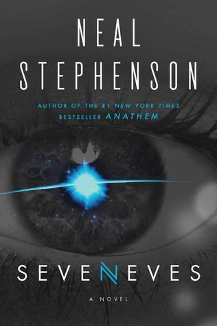
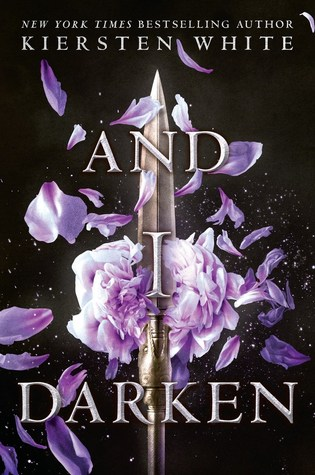
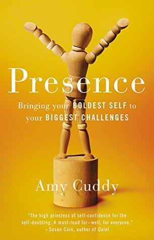
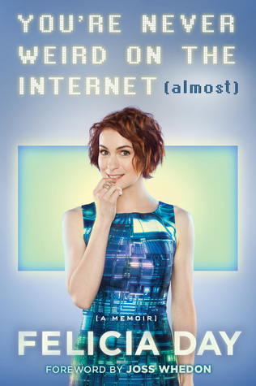

Here's a sample of what I've been reading this summer...

_Seveneves_ by Neal Stephenson

I loved the first half of this book, and I didn't really care for the ending. However, I don't think that should stop anyone from reading it.

_Seveneves_ is a realistic, contemporary sci-fi novel that poses the question "what would happen if the earth became uninhabitable?"  Our characters learn they have approximately 2 years before that happens, and the novel follows their preparations, their struggle, and what comes after life on earth.

If you like sci-fi where the science is accurate, the technology is something that seems possible, then you will enjoy this book.

On the surface, it reminded me a little of the TV show "The 100", except with better science, a more realistic plot, and well, it's really not the same, except the part about earth being uninhabitable for a really, really long time.

 

___And I Darken_ by Kiersten White

I mistakenly thought this would be a young adult / fantasy novel about vampires. Turns out it's historical fiction about Vlad the Impaler, but re-imagined with Vlad as a girl.

I loved this book, and found it very intriguing. I don't know much about the Ottoman Empire and I feel like I've learned a little more after reading this. I'm looking forward to more from this author!

 

 

 

__

_Presence: Bringing Your Boldest Self to Your Biggest Challenges_ by Amy Cuddy

If you haven't seen Amy Cuddy's Ted Talk on Presence, go watch it now!

While I enjoyed this book, I felt it was a little repetitive, went off topic a bit, and could have been a lot shorter. If you really love her Ted Talk and want to know more, then read the book. Otherwise, just enjoy what you learned from the Ted Talk and read something else.

_You're Never Weird on the Internet (almost)_ by Felicia Day

Before reading this book, I knew of Felicia Day from her role on Eureka! and from Dr. Horrible's Sing-Along Blog. I had heard of her show The Guild, but never watched it.

Turns out that she and I have had some parallels in our lives. We're about the same age, and we both grew up right as the internet was becoming mainstream. We both made friends online at a young age, when it wasn't typical to do so. Both of us had mixed results when meeting those friends in person.

Felicia moved to LA to become an actress, and while I did not do that, while she was searching for an acting role, she became addicted to World of Warcraft. I can totally relate to that!

Her book is funny and honest, and was a quick, interesting read. After finishing it, I did watch The Guild, which I recommend to anyone who's into gaming. It's quite funny.
