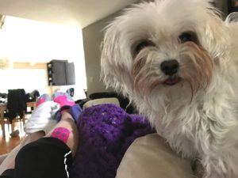

New PR! Woot Woot!  2:50:02, 18 seconds better than my previous best which was last year in Capitola. I was super prepared this time around, and had all my stuff out and ready last night. I spent about an hour at the expo yesterday trying very hard not to buy all the things. On my list for future purchases: new running jacket, more sport bras, new shoes, and anti-fog sunglasses for running. Yes, I need all the things!

I settled for a 13.1 magnet for my car, and of course, the race shirt pictured was included with the entry fee.

I did buy one shirt, but shhhh.... let's not talk about that.

\[gallery type="rectangular" size="medium" ids="1895,1878,1877"\]

It was a beautiful day for a race, not too cold and not too hot. Kimmy and I met up in my corral, and  waited patiently for our turn to start. We both knew she'd be far ahead of me, so we wished each other luck as we crossed the start line.

I really wanted to run this race in 2:45, so I quickly caught up to the 2:45 pace team and settled in. For the first 3 miles, everything was going well, and keeping pace with the pace team was OK. Then around mile 3, I started to get some cramps, so I had to walk for a bit. Thankfully, I was able to keep the pace team in sight and catch up when I would run.

Around mile 5, I was passed by my ex, so that gave me a little motivation to kick it up and start running a bit more, as by this time I was doing run/walk intervals. I'm pretty sure he saw me pass him, so he dashed ahead. For someone who claimed to hate running, why is he at every 1/2 marathon I've done since breaking up with him??!

To my amazement, I was able to keep in view of the pace team until mile 8. This was very exciting for me! However, I definitely don't do enough long runs, and the last 5 miles were miserable for me. I passed by my ex again at mile 9, and boy, it sure seemed like he didn't like that. I had seen him ahead of me for about mile, walking most of the time. Once I passed him, again he blasted past me. I didn't see him again after that, and good for him for finishing before me, and thanks for not trying to talk to me. :)

By mile 10, I was starting to hurt all over. My TFL and my adductor muscles have been acting up, my heel felt like I was getting a blister, and the cramps came back, worse this time.

When I was walking, I tried to really walk as fast as possible, since by now, I was walking way more than I was running. I kept trying to calculate how fast I needed to go to finish with a PR and how fast I could walk to get there. The trouble is GPS never quite matches the course distance.  Argh.

At mile 11, my GPS and the mile marker lined up almost exactly, and I knew I could make it to the finish line around 2:50, which wouldn't be the best PR but at least it wouldn't be slower....

Mile 12.... ah the final mile. I felt so miserable, everything hurt and I just wanted to be done! I did my best to keep a good fast walking pace and to run when I could. 

As I approached the final stretch, I kept thinking "where the hell is the 13 mile marker??!" and "where the F is the finish line?". The one thing I hate about the SJ RNR is that the approach to the finish line is full of turns, so you can't see it until you are almost there (less than .1 mile to go). Once I turned the last corner, I went for it and started running. And then I realized that it was almost 2:50 so I made a mad sprinting dash for that finish line!!!

Kimmy was waiting for me at the finish line, and boy oh boy was I happy it was over!

\[gallery type="rectangular" size="medium" ids="1877,1892"\]

 

And guess what? Next year we are going to Vegas for the RNR 1/2 marathon in November. Running on the strip is going to amazeballs!! 

Here's how I'm spending the rest of my day:

