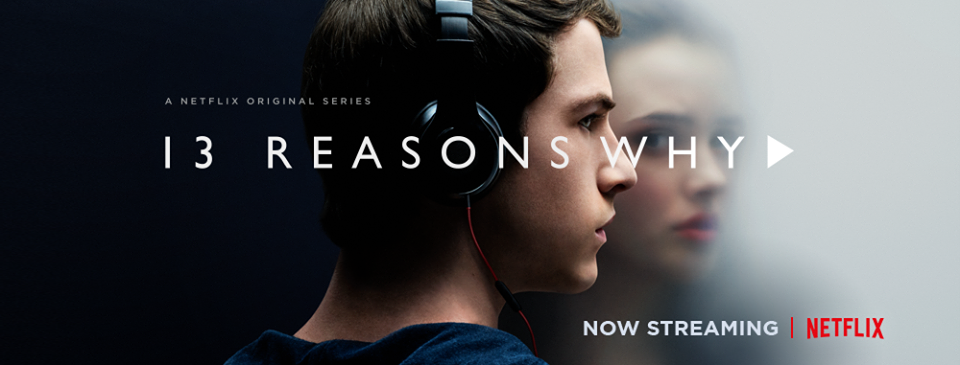

You know, watching a tv show about teen suicide doesn't sound that fun. And it's not. What it is is emotional, thought-provoking, and heart-wrenching. Honestly, I was expecting it to be sad, maybe a little disturbing, and I was not expecting to have such a strong reaction. 

I had heard of the novel a long time ago and forgotten about it. After hearing about the Netflix series, I discovered it was already on the "to read" list. I decided not to read the book. I thought maybe I'd enjoy like the TV show better. And initially, I wasn't sure if I liked the show or not. For those of you that don't know, the plot device of the show (and novel) is 13 audio tapes left by Hannah, the suicide victim. Each tape explains one of 13 reasons why she killed herself and each is tied to a person. Each person is supposed to listen to the tapes and then pass them on the next person. If not, Hannah has left a second copy with someone who will make them public. This naturally lends itself to 13 episodes of the series, and at first, I thought it was one of those annoying plot things that you end up hating, however, by the end, I felt it worked really well to tell the story. As the audience, we are hearing the tapes (and seeing flashbacks) along with Clay. This is interwoven with current events.

Now, here's the part where there might be some **spoilers** so consider yourself warned!

Clay. Clay makes the show for me. Dylan Minnette does an amazing job, and I think it's his emotional distress, his pain, that caused me so much pain while watching this.

Clay was friends with Hannah, they worked together at the local movie theater, and he likes/liked her. But he's awkward around girls, and he doesn't/didn't know how to tell her he likes her. This is clear throughout the show.

It takes him a long time to make his way through all the tapes, the other kids all listened in one or two days. So why wouldn't he do the same? There are several points where he has to stop. It's too much for him. It's painful, and he misses Hannah, and it hurts him to listen to these things that happened to her, things that cannot be changed, events that are out of his control.

This seems like an honest reaction, and given the content of some of the tapes, taking an emotional breather seems like a reasonable thing to do. As Clay is listening to the tapes, he envisions Hannah, and those visions then start to go beyond just imagining her as she describes past events, and turn into nightmares and hallucinations. I don't think I could draw it out like that, but they give him creditable reasons and an emotional state for doing so.

As I mentioned earlier, a show about teen suicide -- not fun? Well the trigger warnings for this don't stop with suicide. The list also includes bullying, abuse, drugs, rape, violence, stalking and probably more.

There is criticism of the show (and the book) for not portraying Hannah as a realistic suicidal person. I agree that she doesn't come across as what I would typically think of as suicidal, but I'm not an expert (and I'm sure many with this opinion are not either).  However -- I think the portrayal of Hannah is "as seen through Clay's eyes", since we are hearing the tapes along with him. A lot of it feels like his memories of Hannah, and, remember, he didn't know she was suicidal until she killed herself. And also, part of the point is that it's often not obvious when someone is suicidal. 

> "You don’t know what goes on in anyone’s life but your own."

The other kids are messed up too. I think this is a strong reminder that everyone has their own life, and you don't know what another person is living through or living with. That doesn't make it ok to be a bully, a stalker, or a rapist though! Have compassion for other people, and remember, they don't know what you're going through unless you tell them, and you don't know about their life either.

Hannah's 13 reasons span a broad-range of "wrongs" committed against her. Some are seriously criminal things, and some are just high-school bullying. I read one article that said it was unrealistic that Hannah would be upset by being listed as "best ass" on best/worst list that was passed around the school. Saying there's nothing wrong with this is saying it's ok to objectify women. She gets hit on, called easy and a slut because of it. Seems justifiable to be upset to me.

I still don't understand Tony's character, and why he didn't immediately take the tapes to Hannah's parents or the police. I know he says he was trying to honor her wishes, but clearly -- at some point there's a line between honoring a dead girl's wishes and being complicit in covering up serious crimes (like rape). Instead, he dutifully follows the tapes from person to person.  There are moments when you think maybe some of them (any of them, it just takes one) will see reason and come clean, and of course, it wouldn't be a tv show if these things all happened at the beginning. There'd be no show!

> “Life is unpredictable and control is just an illusion. And it makes us feel small and powerless.”

Hannah was a bit of a bully and very selfish. She caused a lot of pain by making those tapes and asking them to passed around. She could have left a note (or a tape) that was more to the point for her parents. I think she wanted to give her suicide meaning and to feel like she had control in the end, even though it's not reasonable to assume she'd have any control once she was dead.

There's a lot of hard things to watch in this show. I wasn't expecting the rape scenes, or the graphic suicide scene. It was not easy to watch, it was painful, and that's probably the point. I can't imagine what watching this would be like for someone who's been through those things. Sure, I was bullied when I was a kid, but I have never been suicidal and I have never been raped. I can only imagine, and honestly, I'd rather not.

The last few episodes (starting around tape 11) is where the emotions really started to hit me. I was mad at Hannah for all the mess she created with the tapes, and for what she was putting Clay through. The poor kid really cared for her, and he was doing the best he could. She even says on his tape "Clay, Helmet, your name does not belong on this list."

I'm not usually one to cry at the movies (or commercials, I've heard some people do that!) ... Occasionally, I'll get a little teary-eyed, but unless there's a dog dying, you're probably not going to see me cry while watching a movie (or tv show). And yet..... somehow this show had me bawling like a baby, time and time again.

> “It has to get better. The way we treat each other and look out for each other. It has to get better somehow.”

Hopefully, more people are talking about suicide (and rape and all the other horrible things in this show) and what can be done to prevent them. I'd love to tell you that I have some great ideas, and while I don't, you can bet that I'll be thinking about it, and that I'll be looking for ways to help. 

How can it get better if it doesn't start with us?

* * *

_If you are thinking about suicide, or need help, please talk to someone._ 

_Suicide Prevention Resource Center_

_1-800-273-TALK_
