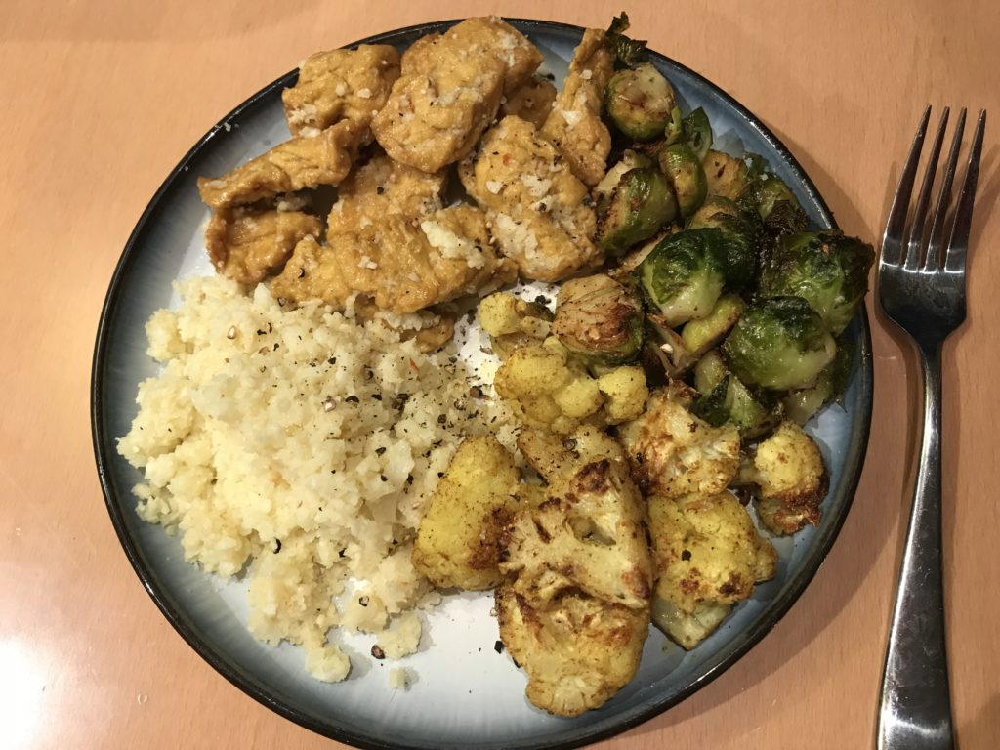
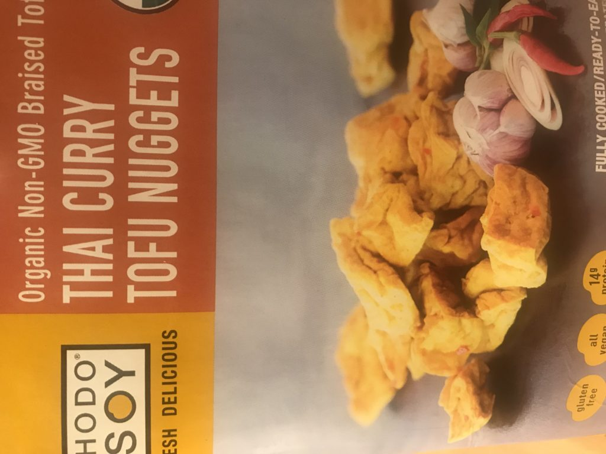

I have a confession. I am terrible at meal planning. When I attempt to do it, I rarely make anything on the plan, instead opting for going out, something quick, or something less healthy. The main thing I struggle with is that I hardly ever feel motivated to invest time in cooking during the week. 

The simple solution? Quick, easy things to eat during the week, like veggie burgers or zucchini pad thai from Urban Remedy (this is delicious, by the way.  I recently discovered Urban Remedy at Whole Foods, and these are my new go-to for quick, healthy meals). I still have a bad habit of buying a lot of random stuff that looks good and then figuring out what to do with it later.

Tonight, I tried to figure out how I could use my cauliflower and Brussels sprouts before they went bad, and I was in the mood for something with tofu.

This is what I came up with, and it was actually really tasty.

The tofu was pre-made and pre-seasoned, and it was my least favorite part of the meal. For the cauliflower, I roasted half of it with coconut oil and some curry spices (cumin, ginger, turmeric, and garam masala).  The sprouts I roasted with lime infused olive oil, garlic, and chipotle, and they came out great. The rest of the cauliflower I turned into "rice" with my vitamix.

All in all, prepping the veggies took the most time, and of course, waiting for them to roast.

Maybe someday I'll get the hang of meal planning, but for now, I'm satisfied that when I put in the time and energy to make a healthy meal, something good often comes out of it.

Next weekend, I'm visiting my mom, and I think cauliflower might make another appearance, but this time in tacos!

Anyone else out there have issues with meal planning?
