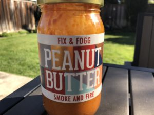
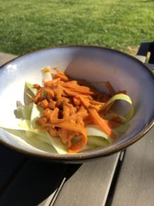

While I was in New Zealand, I came across some spicy peanut butter, called Smoke and Fire. It looked so amazing, I knew right away I had to buy it, even though I wasn't quite sure what I was going to do with it.

I've been trying to eat healthier lately, and focus on eating more whole foods, like veggies and less processed crap and definitely less processed/refined carbs. And what better way is there to exemplify this style of eating than zoodles? And what goes great with zoodles? PEANUT SAUCE!

I started off looking for a recipe for raw pad thai, and this came out as sort of an adaption of a recipe I saw online, modified a lot based on what I had on hand and my own preferences. It turned out amazing! I think it would be even better with more vegetables to add variety to the dish, so I will definitely be making this again.

Zoodles with Spicy Peanut Sauce

Serves 2 (1 if you're hungry and/or not eating anything else with it)

Ingredients:

- 1 zucchini
- 2 carrots
- 1/2 bell pepper
- 1/4 c peanut butter
- 2-3 tbsp fresh orange juice
- 1/2 lime, juiced
- 2 tsp soy sauce or tamari
- 1 tbsp maple syrup (honey or agave would also work)

Directions:

- Peel the zucchini and carrots
- Use the vegetable peeler to cut the zucchini and carrots into zoodles/slices (a spiralizer would also work)
- Slice bell pepper into small thin strips
- Combine peanut butter, orange juice, lime juice, soy sauce and maple syrup
- Mix the carrots and bell pepper with the peanut sauce and serve on top of the zoodles

Variations:

- If you don't have spicy peanut butter, I would recommend adding Sriracha to taste (start with 1 tsp and see how it goes). I would also add some fresh ginger or garlic (1 tsp). 
- more veggies - bean sprouts, chickpeas, cabbage
- garnish - cilantro
