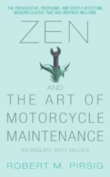

_Zen and the Art of Motorcycle Maintenance_ by Robert M. Pirsig

The introduction to this book claims it has a reputation as "the most widely read philosophy book, ever."  The veracity of this statement seems highly dubious to me.

When I first picked this up, I thought it was a non-fiction title and I was intrigued by the potential relationship between Zen and motorcycle maintenance. As I was reading it, I realized the error of my ways - ah, this is fiction!

It starts off with our narrator, our _unreliable_ narrator_,_ telling us about how he took his son on a cross-country motorcycle trip. I'll warn you now that there are spoilers lurking ahead very soon.

This book has three kind of interwoven parts. The motorcycle trip, the chautauquas, and his memories/past which arise partly during the road trip and partly during the chautauquas. The narrator describes the chautauquas as _"an old-time series of popular talks intended to edify and entertain, improve the mind, and bring culture and enlightenment to the ears and thoughts of the hearer."_

During the chautauquas, this is the philosophy part, and it's where he explains that it's Quality that's the mother of everything and attempts to express where classical and romantic interpretations fall short. Both the motorcycle trip and the chautauquas contain a smidgen of motorcycle maintenance, but hardly enough to warrant its place in the title of the novel.

Most of the novel is spent as part of the chautauquas, telling us this and that about Quality, and seemingly talking about philosophy. To be honest, it was hard to follow.

Early on, we learn of the third storyline, that of Phaedrus, who we are told spent his life chasing a ghost. It seems as though we are chasing Phaedrus across the country. And yet... What we learn is the our dear narrator _used to be Phaedrus._ Before he went insane and underwent electroconvulsive therapy (aka shock therapy) and emerged a new/different person with no memories of Phaedrus and his earlier life.

I warned you there were spoilers. Turns out he's starting to remember. And it's unclear if it's our narrator or Phaedrus who's the bad guy. Also unclear whether or not we (the reader) care.

And oh yeah -- this is a _"fictionalized autobiography"._ I'm not sure what that means, but according to Wikipedia our author (aka the narrator, aka Phaedrus) "spent time in and out of psychiatric hospitals between 1961 and 1963. He was diagnosed with paranoid schizophrenia and clinical depression as a result of an evaluation conducted by psychoanalysts, and was treated with electroconvulsive therapy on numerous occasions..."

I did not enjoy this book. I found it hard to follow, and hard to understand. However, it made me want to read other books on philosophy, perhaps books that fall more squarely in the philosophy category - like Plato and the Plato Dialogues for example. For inspiring me to learn more, it gets two stars. Otherwise, I think I would have given it 1 star.

More on philosophy to come! Check back soon!
