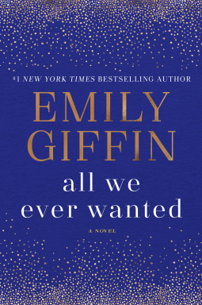

_All We Ever Wanted by Emily Giffin_

_I received an advance copy of this book from the publisher (through NetGalley) in exchange for a fair and honest review._

I've read and enjoyed several other books by Emily Giffin, so when _All We Ever Wanted_ popped up on NetGalley, I jumped on the opportunity to read this one before it was release.

_All We Ever Wanted_ tells the story of a teenage girl, Lyla, who is the victim of bullying. Finch, a boy she has a crush on, shares a compromising photo of her with his friends via text message. The photo quickly spreads, and Lyla's father, Tom, and Finch's mother, Nina, get involved.

This incident shows some of the pitfalls of the technology era we live in, where teenagers think it's acceptable to take and share less than appropriate photos of themselves, and others, online. It reminds me of _!3 Reasons Why_, and the important message of why we should have zero tolerant for bullying.

Alternating view points, the story centers on Lyla, and her desires to fit in and forgot about the incident, while Tom and Nina feel justice is deserved and want the truth to come out. Having the story told from these 3 view points was essential to the story, showing how different parents and children react to situations.

The book also touches on racial and class bias. Lyla is half Brazilian, and she and Tom live on the poor side of town, while Nina and her son Finch, live in mansion and attend the local country club. Tom is sure Windsor Academy, the prestigious private school Lyla and Finch attend, will fail to punish Finch appropriately since his parents have the means to make large financial donations to the school, and have done so in the past.

Overall, was very engaging, and a quick read. The only drawback, in my opinion, is that after the slow buildup of the characters and events, the ending feels rushed and unsatisfactory. I wanted more depth and substance. The flash forward in time was nice, but felt lacking.
