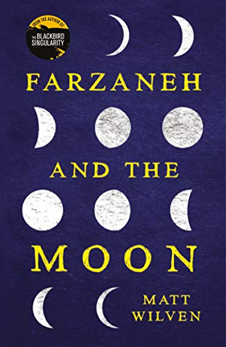

 

## _Farzaneh and The Moon_ by Matt Wilven

_I received an advance copy of this book from the publisher (through NetGalley) in exchange for a fair and honest review._

The book opens with N burying Farzaneh under the light of the full moon. It's very mysterious and sets a fantasy-like tone for the novel. However, the fantasy disappears after this intro, only to reappear in the last few pages.

I almost quit reading this book several times. Our narrator and main character, N, is a new University student and struggling to fit in. At first, it was interesting, but as he becomes involved in a relationship, I started to lose interest. The girl he's dating definitely has some issues, and he's clearly not happy, and stays just to be in a relationship. Ugh.

We don't get much background on N. No indication as to why he's chosen to study for philosophy, and not much in the way of character development. He's just a guy who goes from one twisted, somewhat co-dependent relationship to another even more twisted relationship.

N wanders through life examining things through the eyes of his philosophy course work. When he meets Farzaneh, they have a strong connection and the book really picks up here.

As the story unfolds, it becomes clearer and clearer that Farzaneh is mentally unstable. There is nothing magical or fantastical about her, she comes across as deluded, maybe manic.

The main story of the book does not fit with the introduction and the ending. It's possible this is the author's intent, and we are supposed to question the reliability and sanity of our narrator, N. For me, it fell flat and would have been hugely disappointing had I not been immensely relieved that the book was finally over.

Perhaps more introspective into the psyche of N, letting us in on why he believes that reality only exists for him through Farzaneh, would have helped. Perhaps not.

I would not recommend this book.
