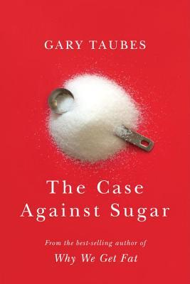

As many of you know, I'm an avid reader. My co-workers were actually joking that I was probably going home from the holiday party in order to read. And I did... at 3am. It's a habit and it's hard for me to get in bed and go to sleep without reading first. And that's not the only time I spend reading. This year, I thought I'd share with you my top books. These books were not all published in 2019, just books I happened to read this year.

If you're curious to see all the books I read, you can check out my 2019 "year in books" from goodreads.com. I surpassed my reading challenge goal of 60 by quite a bit this year. This is due to my new habit this year of listening to audio books, and the addition of Audible Originals and the 2 free selections per month.

Ok, let's get back to the best books of 2019. These are in no particular order, and are not necessarily the books I rated the highest. I chose each of these five books for the impact they had on my life and the stories they tell.

_A Court of Thorns and Roses_ by Sarah J. Maas

"_To the stars who listen and the dreams that are answered._"

I am huge fan of fantasy novels, and this one was spectacular. I loved the series so much, that I actually read the entire second book on an airplane (Munich to San Francisco is such a looooong flight!), and finished up the third the day I got home. I would recommend this series to anyone that enjoys YA fantasy with a good romance plot.

_The Case Against Sugar_ by Gary Taubes

This year, I've been trying to focus on making healthier choices in my life. My relationship with sugar has been difficult, to say the least. As much as I try to break up with sugar, we keep getting back together. _The Case Against Sugar_ was really an eye-opener for me as to just how terrible sugar actually is for us, and has helped motivate me to cut a lot of sugar out of my life. Even if you feel like you don't have a sweet-tooth, sugar (including high fructose corn syrup) is very pervasive in our modern processed, commercially available food. Once I started looking, I noticed that almost everything has added sugar, it's even lurking in unexpected items like bagels! This book has caused me to rethink my eating habits and to be extra careful with reading labels, and most importantly, to start ditching the processed stuff (i.e. junk!) in favor of home-cooked foods. I would recommend this book to anyone who's interested in health, better eating, worried about diabetes, or well anyone who eats!

_Ketotarian_ by Will Cole -- Another food book! While _The Case Against Sugar_ presents historical data, science, and research about sugar and how it affects our bodies, _Ketotarian_ focuses more specifically on the keto diet (high fat, low carbs), and how to adopt this type of eating while being vegan or vegetarian, although the author does recommend eating some animal products like eggs and fish. This book was recommended to me by my doctor with the caveat that she doesn't think I necessarily need to go to the extreme low carbs prescribed by the keto diet, she would prefer to see me eating more healthy fats, less grains, and less carbs overall. I completely agree, and will soon be incorporating some of the recipes from this book into my meal-planning rotation. I would recommend this book to anyone interested in a new, potentially healthier way of eating.

_Maybe You Should Talk to Someone_ by Lori Gottlieb -- I wasn't expecting to like this book. It popped up very quickly as a hot book, and I figured I could wait 4-6 months to read it when it was available for Kindle from my local library. However, the new book club I recently joined picked this as their selection. I missed the original event invite, and ended up having a marathon reading weekend to read it time for book club. I enjoyed this book quite a bit more than I expected! I love how the author weaves together her own story with those of her patients. Most of all, I love the message that it's OK to be in therapy, it's OK to need to talk to someone, even therapists have therapists!

_Bad Blood_ by John Carreyrou -- This is another one that I wasn't expecting to like, even though multiple co-workers recommended it. Despite the fact that I live and work in Silicon Valley, I had only vaguely heard of Theranos - mostly through advertisements about getting bloodwork/lab tests done at Walgreens. I wasn't really aware of the meteoric rise and fall of Theranos, so when people kept telling me to read this book about Theranos, I didn't quite understand. Having read the book, WOW. I started a book club at work, and earlier this year, we read a book called "The Five Dysfunctions of a Team", which talks about -- you guessed it! -- the five dysfunctions of team. That book illustrates the dysfunctions through a fictional story of a fictional company and team. They could have easily written about Elisabeth Holmes and Theranos instead! I would recommend this book to anyone who likes true stories and/or investigative journalism, and is interested in how a company can fake their way to a 9 billion dollar valuation.

I hope you've enjoyed reading about what I think are some of the best books of 2019. Drop me a comment if you've read any of these, or if you're thinking about it after reading this!
