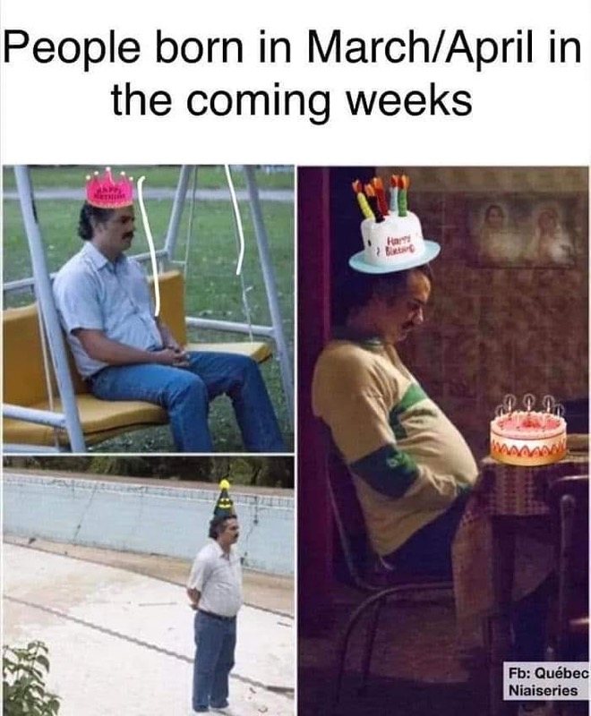

It's day 4 of quarantine for me. Figured I'd starting blogging about this just for something extra to keep busy.

Let's see. I came home from vacation on Sunday. Days earlier, my company asked me to work from home for 2 weeks following my international travel due to COVID-19. I think that's where life started to skew from normal. But hey -- 14 days at home, I could do this, no sweat! I wasn't even really thinking of this as a quarantine, but an experiment at an extended working from home period, to see if I could ever sustain it longer term.

Before coming home, I could see that California was going to be different when I got back. There were some early indications of panic and shoppers stockpiling things like TP. So, I did what any good techie-nerd would do -- I ordered some from Amazon and picked a shipping speed so that it would arrive just after I got home. I did the same with my grocery delivery order, a new Kindle, cat food, and a computer monitor (to facilitate the extended period of working from home).

On Sunday, things seemed fairly normal. It was early when I got in, so I took a nap, put away the groceries when they arrived, did my laundry. Not all that different from any other trip.

## Day 1 - Monday, March 16th

By this time, everyone at my company had been asked to work from home for the rest of the month. I've done it before, so this was nbd for me.

The big news was several bay area counties (where I live) announced a "shelter-in-place" edict, for everyone to stay the f#$% home except for essential needs. This edict is in place through April 7th or until changed.

The pandemic is starting to feel more real now. Also, I sort of want to play Pandemic the board game, and think I'll look into online versions since it won't be any fun to play alone.

## Day 2 - Tuesday, March 17th

My new monitor arrived. I'm still getting used to using a monitor at home (on my dining table, but it's definitely, definitely better for my posture.

I also spent part of the day trying to track down Flonase. Most drug stores were either out of stock online or said shipping would take 3-4 weeks. Even Amazon couldn't get it here faster than 8-10 days. I even tried curbside pick-up from Safeway, no spots left, and I didn't feel like attempting to drive over there. I finally placed an order from Wal-Mart, but it won't arrive until Monday, which sucks. Why does that suck? Well, for those of you who don't know, Flonase takes up to 2 weeks to really start working. So waiting almost a week to start it means that much longer until it works.

## Day 3 - Wednesday, March 18th

It's only day 3, and I'm already itching to get out of the house. It's funny, most days, I'd rather stay home, but when it's mandated "quarantine,” it's not so fun.

I wanted to get out just for caffeine and for Flonase. My doctor just recommended I start taking it again, and what I thought was a full one turned out to be empty.

I ran out to CVS between meetings at 8am. Turns out that during this time, they've reduced their hours and aren't opening until 9am. Shit. Grocery store? Won't have Flonase AAAAAND they aren't usually open but they are doing senior citizens only hour. Rather than trying another drug store or pharmacy, I stopped at Chevron for Monster and Doritos.

Work-wise, everything is still ok. To facilitate social time, I hosted a lunch "meeting" over Zoom and got to chat with some of my co-workers that I don't usually meetings with and thus won't be seeing a lot of the next few weeks.

## Day 4 - **Thursday**, March 19th

Today's Kari's birthday! Happy Birthday Kari! Ashley arranged a surprise lunch over Zoom. Let's just say that over a dozen people trying to sing happy birthday over Zoom is quite hilarious.

Robin and I both have birthdays coming up soon too, and she sent Kari and this earlier this week...

Today was my second attempt to find Flonase. I went to CVS in the afternoon, now that I know the updated hours, I was sure they'd be open. Turns out I got lucky, and they had a few left in stock. I also went into the grocery store and grabbed some cheese (smoked cheddar), tea, honey, and sourdough baguette.

The big news of the day was Gavin Newsom's announcement of a new, statewide, stay at home edict. This one doesn't come with an end date -- "until further notice."

I'm not sure I like the sound of that.

So, "until further notice", I'll be blogging and tell y'all about my life in quarantine.
