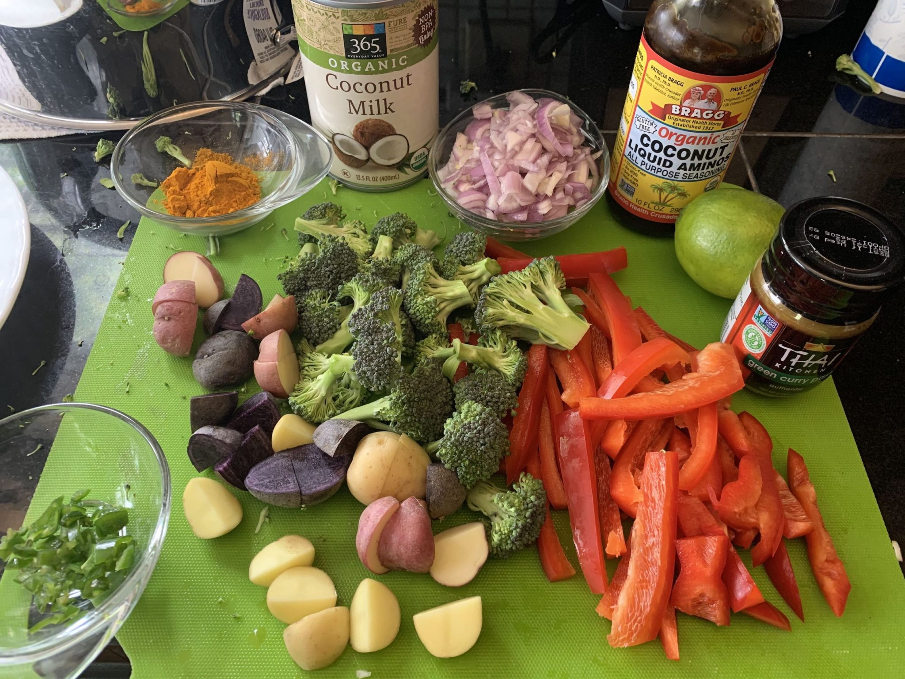

I made green curry!

Here are some photos...

I'm not much of a recipe person, so I didn't really measure anything except where noted below.

Here's a rough recipe:

- Press tofu then fry with a small amount of oil (I used avocado oil)
- Toss the tofu with the dry spices (this is the only thing I measured -- 1 tsp turmeric and 1 tsp curry power) and some coconut aminos after frying and then set aside
- Sauté the chili pepper, garlic, shallots, and ginger until soft
- Add broccoli, potatoes, coconut milk (I used two cans, use less if you like it less saucy), salt and pepper, green curry paste (I used the whole jar) and a dash or two of coconut aminos
- Simmer for 10 minutes
- Add tofu and bell peppers and a squeeze or two of lime juice to taste
- Simmer another 10 minutes or until veggies are tender
- Adjust salt, lime, coconut aminos, and spiciness (you can add cayenne or sriracha if needed) to taste
- Top with cashews and serve with rice!
