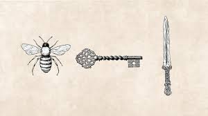

While I was on vacation, I read _The Starless Sea_ by Erin Morgenstern. I hesitated to pick up this book, as I found her first novel, _The Night Circus_, to be quite tedious and boring. However, I am very, very glad I gave this book a chance. I absolutely fell in love with it.

_The Starless Sea_ is an amazing adventure. It centers around Zachary Ezra Rawlins and his discovery of the Starless Sea, and yet, in the end it is unclear if he is the main character, the narrator, or merely just a player in the story within the story within the story.

I have rarely come across a book like this -- layer upon layer, containing many stories within stories. Six other stories are interwoven and interconnected within _The Starless Sea_. Each tells a different tale... or are they all the same tale?

How would you feel if you found an ancient-looking, author-less, uncatalogued book in the library that seemed to recount, no wait, honest to goodness DID recount, a story from your childhood? Not just a story, but actual events that took place in your life.

This is what Zachary Ezra Rawlins discovers when he finds _Sweet Sorrows_ in the library. This is what leads him down the proverbial rabbit hole in search of the Starless Sea. Little does he know that his actions are being tracked, that he, the son of a fortune teller, is the key.

If you have a love of adventure, a love for stories or storytelling, you might fall in love with this book just as much as I did. There is mystery, intrigue, mythology (or perhaps legends might be a better word?), evil, and love contained inside.

Have you ever wondered what would happen if the Moon and Sun could meet? What if Time and Fate fell in love? What if there was a wondrous secret world beneath the world filled with marvels and stories?

This was a book about endings, as much as it was about many other things too. Are endings truly the end? Or does one story have to end simply so another can begin?

I highly recommend this book! However, as Erin Morgenstern says -- "_Books are always better when read rather than explained_."

★★★★★

<iframe style="width:120px;height:240px;" marginwidth="0" marginheight="0" scrolling="no" frameborder="0" src="//ws-na.amazon-adsystem.com/widgets/q?ServiceVersion=20070822&amp;OneJS=1&amp;Operation=GetAdHtml&amp;MarketPlace=US&amp;source=ss&amp;ref=as_ss_li_til&amp;ad_type=product_link&amp;tracking_id=cometgrrl-20&amp;language=en_US&amp;marketplace=amazon&amp;region=US&amp;placement=B07MQPHKSL&amp;asins=B07MQPHKSL&amp;linkId=28d8c8f1b2d5cb4f3a9f6ce7c14d497e&amp;show_border=true&amp;link_opens_in_new_window=true"></iframe>
