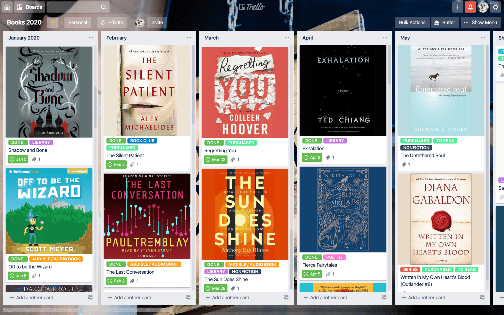
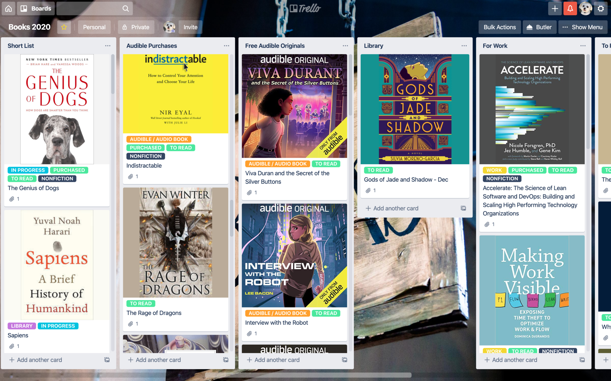

I switched over to reading almost exclusively on my kindle several years ago. Since then, I haven't bought very many physical books, and I've actually even reduced the number of books that I have in my house. I miss books, and I miss being able to organize them, but I don't miss moving them, the space they take up, or dusting the book cases.

So, instead of organizing my physical books, I spend my time organizing my list of books that are "to be read", or tbr for short.

There's currently 887 books on my tbr shelf on goodreads.com. That's a lot of books! And there's just no way I can go through 887 books when I'm ready to read the next one. I've tried culling the list, but there's no easy way to do it. Also, it will take me 10+ years to read that many books, and there are always new books (and old books) to add to the list.

Last year, I started keeping track of my books in Trello. This is not a sales pitch for Trello, it's just what works for me.

I have a column for each month, and I plan out roughly what I want to read for the current month and the following month. Right now, there's only two books scheduled for May, but there are 3 in progress books and 4 that I haven't started slotted for April. Those are definitely going to spill over into May. The problem is I've been reading books that weren't prioritized so now I have too many books scheduled for this month, but that's ok. Trello is super flexible and easy to use.

If you look at the second screenshot, you'll see that after May, there's a short list. I had to add this because I kept adding too many books each month. The books in here are usually pre-orders, book club books, or something I really want to read soon. After that is Audible purchases (because I buy them faster than I can listen to them), Audible Originals (soooo many, I can't keep up with 2/month while not driving to work every day). The library column is sparse right now, usually I have a list of the e-books I have on hold and when they are expected to be available, but I'm trying to get through the short list before getting any more library books. Then comes work books, the main tbr list (which only has 20 or so books on it right now). Lastly, there's a list of book club ideas, and a list that's a place to stick notes (like which series is getting a tv show).

Each book has its own card and labels, and room on the card for notes, pictures, whatever. This gives me a place to put my thoughts about a book, and while I just recently started this, I find it super useful.

Why not use goodreads.com you might ask? Well, for one, I find their website really slow and clunky. It's hard to move a book from one shelf to another. In Trello, it's visual and really easy to drag a book from one list to another. And it's very visual, which I like.

Of course, there's still 887 books tbr according to goodreads, I still use it to look up books, descriptions, and ratings. And of course, I'm marking them off as I read them on goodreads too, not just Trello.

Maybe someday I will be able to clean out the list on goodreads, but for now, I'm happy with what I have in Trello.

Anyone else spend time figuring out what to read next? Am I weird that I have this whole system in place?
