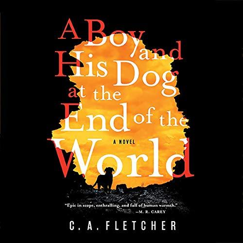

_A Boy and His Dog at the End of the World_ by C.A. Fletcher

I recently finished listening to this book. A post-apocalyptic journey about -- you guessed it -- a boy and his dog. Gris, our main character and narrator, tells the story of his adventures by writing in a diary/journal. He says he's writing this for "you", a boy he found an ancient picture of, who looks exactly like him.

Without giving away too much of the plot, Gris lives in a world where technology is dead. Most of humanity is dead. Gris and his family live alone, on a small island. Gris has been told no one lives on the mainland (USA) anymore, every died and it's not safe there. Something happened that made reproduction uncommon, and even the dogs rarely give birth.

When a strange man comes to trade with the family, Gris ends up going on a very unexpected adventure. What follows is a story about loyalty, hope, survival, and belief in yourself. In the end, no matter what kind of world we live in, always value kindness.

Right around the same time I started this book, I also came across a movie "A Boy and His Dog" which is also a post-apocalypse story about a boy and his dog. The movie was terrible and I turned it off. The book was quite enjoyable with a few interesting twists.

Don't watch that movie, it sucked. The book, however, comes highly recommended by me!

★★★★
