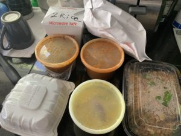

If you've ever eaten at a restaurant with me, you may have noticed that I have a weird inability to order just one thing. I'm always ordering appetizers or sides or multiple main dishes. I like to sample!

It's weird because when I cook at home, it's almost always one thing. A quesadilla, a stir fry w/ rice (that hardly counts as a second dish), pizza...

So, now that we have this lockdown, I feel compelled to over order even more than usual. Like since I'm taking this risk and tipping well I should maximize what I'm getting.

Last weekend I ordered two dishes from the Thai place. About what I would normally order. Tonight I somehow ended up with 5 dishes and two sides.

At first, I was just going to get Indo-Chinese fried rice and Gobi Manchurian. But then I realized they had South Indian selections. Finally, after deciding I was ordering too much, I discarded the samosas and the dosa. And yet... 5 dishes and two sides!

The good news it is all delicious and I won't have to worry about cooking for at least 2 more days. That's good because it's hard to cook and whatnot with my hand.

Anyone else find themselves unable to order just one thing? Why is it so hard to choose?
