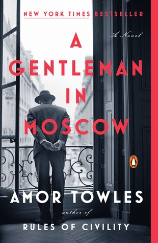

What a timely coincidence to read this book now. I believe my mom purchased it in early 2018, and since her Kindle library is shared with mine, I had access to it. However, I wasn't really aware of it until I read _Forward_.

_Forward_ is a collection of short stories curated by Blake Crouch. In the afterword, he highly recommends _A Gentleman in Moscow._ When I went to add it to my tbr list and purchase a copy, I discovered it was already on my Kindle! That's always a nice surprise.

All of this happened back in January/February. I knew nothing about the plot, apart from the title. Since then, it's come up in conversation a few times (or popped up online in some article or list of books to read), but I still didn't know much about it.

I'm glad I didn't know anything going in. Sometimes, the best way to ruin a book is to know too much beforehand. I like being surprised (most of the time). With that said, you can keep reading if you want with this warning -- I'm going to talk, generally, about what this book is about. Hopefully, without spoilers.

Count Alexander Rostov is sentenced to house arrest, at the Metropol hotel in Moscow. It's 1922, and the Bolsheviks are in charge. As a "Former Person", he has to adjust his world to the confines of the hotel. Kicked out of his lavish suite and relegated to a 100 sq. ft room in the attic, this is quite the adjustment.

Rostov considers himself a man of purpose. He's lived an adventurous and somewhat glamorous life up to this point. The novel tells the story of how he comes to terms with his new reality, and how his life unfolds within the confines of the Metropol over decades, while life continues to evolve and change outside.

> For the times do, in fact, change. They change relentlessly. Inevitably. Inventively.

The backdrop of Russia, the Kremlin, and communism is central to the novel, but not the heart of the novel. The heart of the novel is Rostov, his transformation, his journey to understand what it means to be a man of purpose given circumstances not of his choosing.

> ...if a man does not master his circumstances then he is bound to be mastered by them.

★★★★
