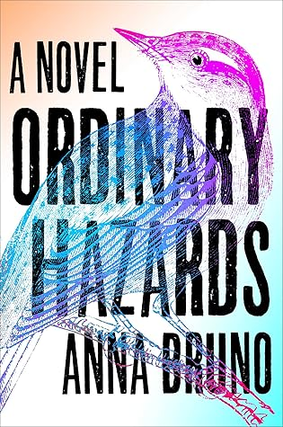

This book was so boring. Emma, our narrator, alternates between telling us real-time events happening in the small town dive bar, The Final Final, and showing us flashbacks of her life.

It appears to be a typical city-slicker moves to the country type of story. I wouldn't know what it actually is because I only read the first third of the book. I kept waiting something, anything interesting, and in its absence, I quit reading.

_I received a free copy of this novel from NetGalley.com in exchange for a fair and honest review. All opinions are my own._

★
