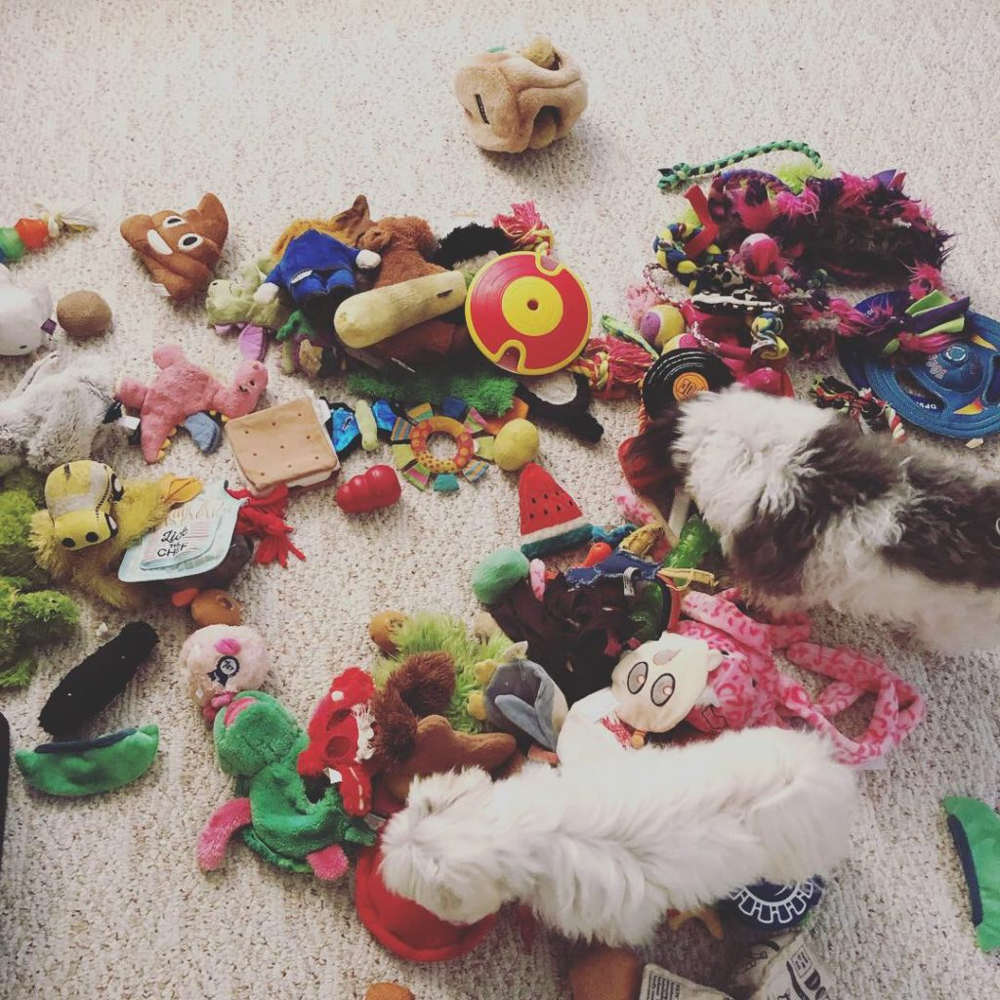
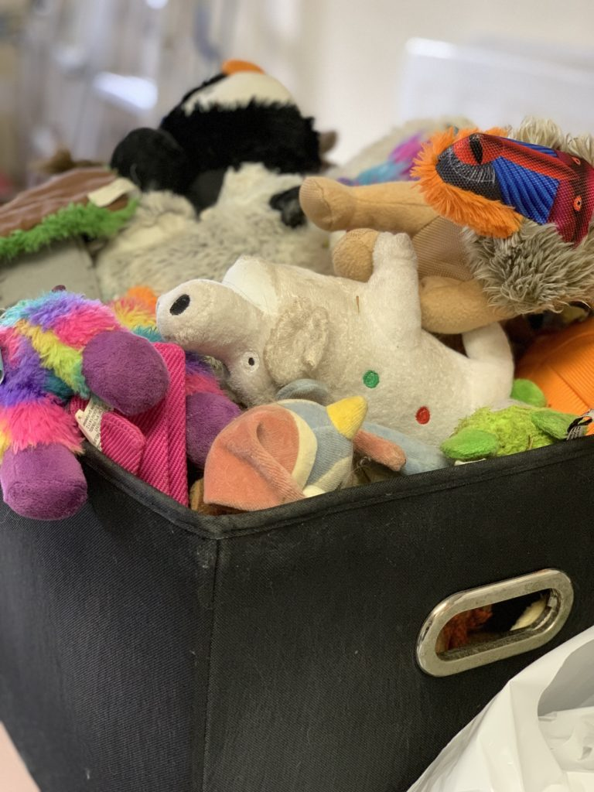
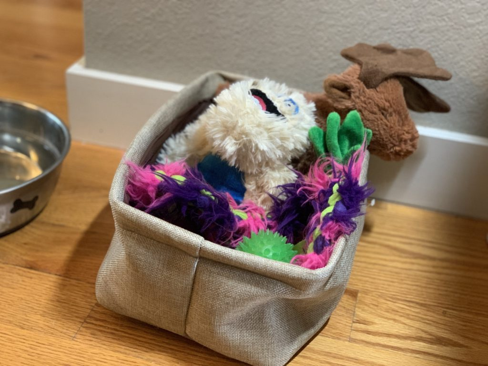

My dog has too many toys.

<figure>

<figcaption>

This photo is from November 2018, we selected toys for the puppies we were fostering and toys to donate to the dog rescue.

</figcaption>

</figure>

<figure>

<figcaption>

This is Indy's toy basket. It has about 50 toys in it, the rest are in the guest room in a bin. At any given time, most or all of these toys are NOT in the bin, they are on the floor, the dog bed, the sofa, under the sofa and in need of rescue (it's always urgent!), on my bed, under my bed, or under my desk. This basket is now located in the garage. Shhhhh, don't tell Indy.

</figcaption>

</figure>

<figure>

<figcaption>

This is the new toy basket. 5 toys only.

</figcaption>

</figure>

<figure>

- 
- 

<figcaption>

Indy went straight for his favorite ball. Thankfully, he didn't seem to notice that 97% of his toys are MIA. And yes, his tongue really is that long (longer actually, if you can believe it!)

</figcaption>

</figure>

You may have noticed that I'm only talking about Indy's toys. Well, yes, they are technically Indy _and_ Roxy's toys. But Roxy is not the one who takes 30 toys out of the box at every and any opportunity. Roxy is not the one who barks and whines when he can't reach the toys at the bottom.

Let's see how it goes with only 5 toys. In a week, any toys that don't seem to get attention will be put in a donation pile, and toys that do will be swapped with others from the stash. Maybe this way we can eliminate some of the toys without Indy noticing. I tried once to get him to pick, we played "keep one, donate one", but he kept stealing the toys from the donation pile, so I gave up.

If you have pets, what do you do with their toys? Do you think they have too many?
