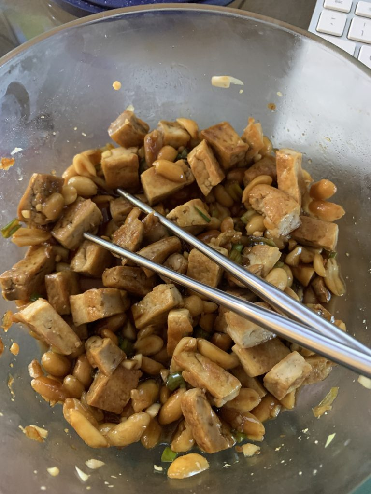

This "salad" is a favorite of mine from Zanotto's. I love it because it's a great grab and go lunch, and it's packed with protein, and super tasty with a nice mix of spicy, sweet, and tangy.

This is my attempt to recreate it, ymmv.

Ingredients --

- extra firm or firm tofu
- oil for cooking tofu (I prefer avocado oil for high heat cooking)
- toppings
    - peanuts
    - green onions, chopped
    - garlic, minced
- marinade/sauce
    
    - soy sauce
    - maple syrup
    
    - hot chili oil
    - rice vinegar

Directions --

1. Press your tofu!
2. While the tofu is pressing, chop your green onions and mince your garlic. For 8-10oz of tofu, I used 2-3 green onions and about 3 cloves of garlic.
3. Cut tofu into bite size pieces, I like mine small, but you can do bigger, it's your choice.
4. Pan fry the tofu with a touch of oil until brown (on all sides as much as possible)
5. Add tofu and toppings to bowl/container. You may have noticed by now that there's no quantities listed next to the ingredients. This is a totally customizable recipe, so I've left it very open. Add a few peanuts or a lot. I like peanuts, and I put about a ratio of 3:1 (tofu:peanuts).
6. Make the marinade. If you're nervous, make it in a separate bowl. If you're adventurous, put it directly in with the tofu. You'll want enough total volume to coat with some left over.

Here are some tips on how I make the marinade. I start with the soy sauce, this is my primary ingredient. Then a splash of maple syrup for sweetness. Hot chili oil -- add to your tolerance. I don't like it to overpower the other flavors, so I used just a dash or two. For the rice vinegar, again, just a dash or two. I add very small amounts of everything and then add more to adjust the spicy, sweetness, tangy as desired.

Other tips -- I completely forgot about lime juice, but usually I use lime juice and not rice vinegar. You can also add fresh diced or sliced chili peppers, like jalapeño or serrano peppers. For sweetness, if you don't like maple syrup, you can use brown sugar or agave. I actually think brown sugar works best flavor-wise but maple syrup is easier. Other options to add would include ginger (grated) and rice noodles.

I usually eat this as-is or chilled, but you can throw it on top of rice, noodles, or on some greens to make an actual salad.
