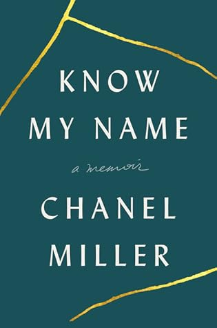

As promised, this is a proper post/review of _Know My Name_ by Chanel Miller. This book is memoir detailing the aftermath of Chanel’s sexual assault, which took place in 2015 at Stanford University at a frat party.

I remember hearing about this when it happened. I remember being vaguely outraged upon hearing his sentencing - 6 months! However, prior to reading her book, I did not read her victim statement, or really know any details of the case. Just bits and pieces and enough to know it was unfair.

Chanel's story breaks my heart. She was shoved into a legal system without having much explained to her. And while she won her case, the way her legal team handled it seemed weird to me. Maybe I watch too much on TV or in the movies to know what should really happen.

It's not OK that this happened to her. It's not OK that it took YEARS for her to get justice. It's NOT OK that he got off with a sentence of 6 months and out on probation after serving only 3 months.

I hate that the media apparently focused on his lost potential as an Olympic swimmer. Hello, wake up! I don't want someone like him representing my country at the Olympics! What about her life? Why does his matter more?

Why are the victims of sex crimes further victimized by our society? Why are we so quick to make excuses for the assholes that do these things? Where is the solidarity and compassion for the ones who suffer the most?

It seems like I have a lot of questions and not many answers. I'm sickened by how our society reacts, and it's horrible what people have gone through, will go through, are going through for the rest of their lives. As a society, we should protect the victims, not the perps. Yes, innocent until proven guilty, but geez, stop saying things like "she was asking for it" or commenting on how a woman was dressed. That's not OK, it does not make it OK. It's irrelevant.

The one good part of the story is that the judge was recalled. Over a million people signed online petitions to get this on the ballot, and he was voted out.

How do we make the system better? What can we do as individuals? One simple thing is to support (by donating or volunteering) organizations like Joyful Heart Foundation. They have initiatives to end the backlog, and get rape kits processed. I'm sure there are many other worthy organizations, this is just one example.

We can also speak up if we are victims of sexual assault or harassment. It's time to say it's not OK, it's never Ok. And, of course, show compassion and caring for those who need it.

I feel silly rating a book like this, who am I to rate her memoir, to put a number of stars next to her experience of sexual assault? All I can say is she told her story from the heart, she moved me with her words, she is an excellent writer, and I'm so sorry this happened to her.
