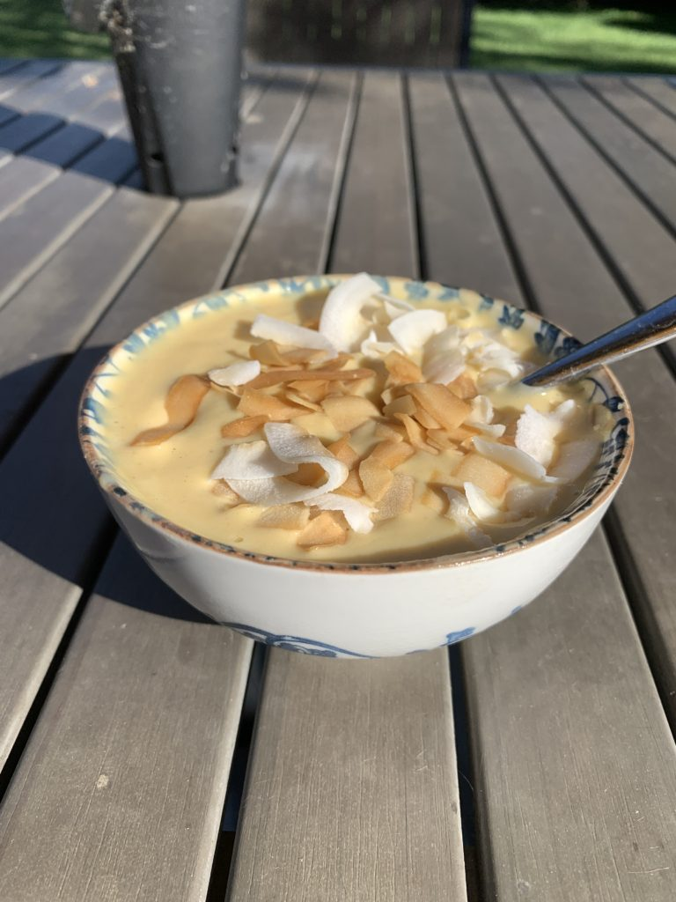

Last year, my doctor recommended an elimination and challenge diet. The idea is to elimination a bunch of stuff for 3-4 weeks, and see if you feel better. If you do, then you "challenge" one item at a time to see if your symptoms come back. This is mostly for digestive issues.

The first time around, I figured, let's do the whole list, that way I don't have to do it again if I do only the top 5.

This is the list:

- **gluten**
- **corn or corn products**
- **eggs**
- **soy**
- **dairy**
- alcohol
- caffeine
- refined fats and oils
- sugar, HFCS, artificial sweeteners
- nightshades
    - tomatoes
    - potatoes
    - peppers
    - eggplant
    - cayenne
    - paprika

Let me tell you, that was a hard 3 weeks. But I felt a lot better! Then, as I added things back, well, once you add certain things, that opens up a lot of options for eating out. And I went from eating a very healthy diet of veggies and lentils, rice, beans, to eating nachos, pizza, etc.

The conclusion? I felt yucky again, but didn't know for sure what it was, except maybe the overall quality of what I was eating post elimination. I felt sure it was gluten or dairy, and thought about a repeat for just those two.

However, my doctor feels strongly that there's often more than one cause, and that _at a minimum, the top 5 should be eliminated and challenged._

So, I was going to do it earlier this year, but got sidetracked, then it was vacation time. Not wanting to be on a restrictive diet during my vacation, I thought I'd do it when I got back. Then came the quarantine, and I thought "no, no no, I don't want to do that NOW."

I've been putting it off for too long. So starting this week (yesterday actually), no gluten, corn, eggs (which I already don't eat), soy, or dairy. I'm stocked up on lots of fresh veggies, lentils, beans, quinoa, corn AND gluten free taco shells....

The problem? It's 100 degrees. No way am I going to be roasting veggies or cooking stir fry. I've been living on carrots and smoothies. The smoothies are great, don't get me wrong, but I'm sooooo craving some chips or cheese and crackers. Thankfully, I ate most of the off limits foods before starting so there wouldn't be temptations in the house.

2 days down, 19 to go. Wish me luck!

<figure>

<figcaption>

Tonight's dinner - mango banana protein smoothie bowl topped with coconut

</figcaption>

</figure>
