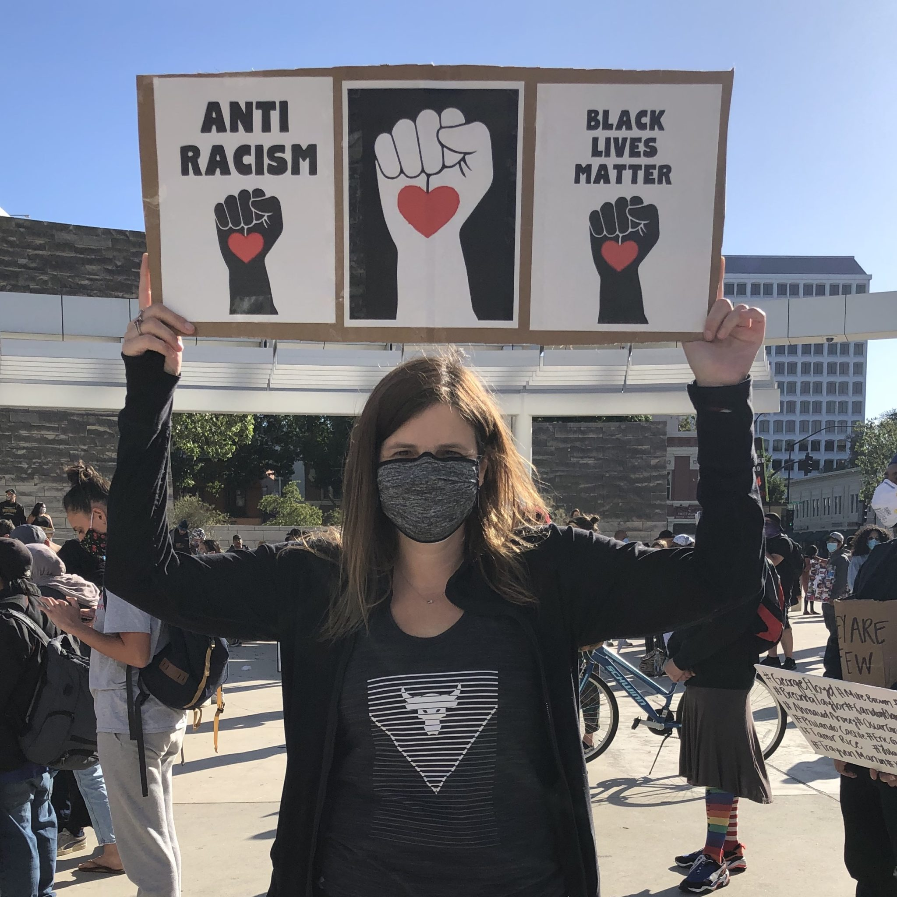
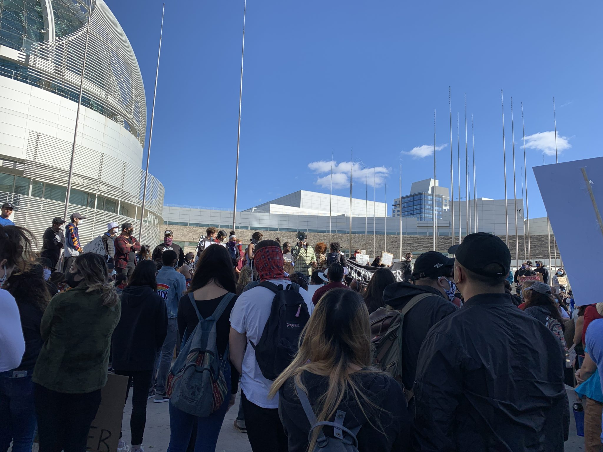
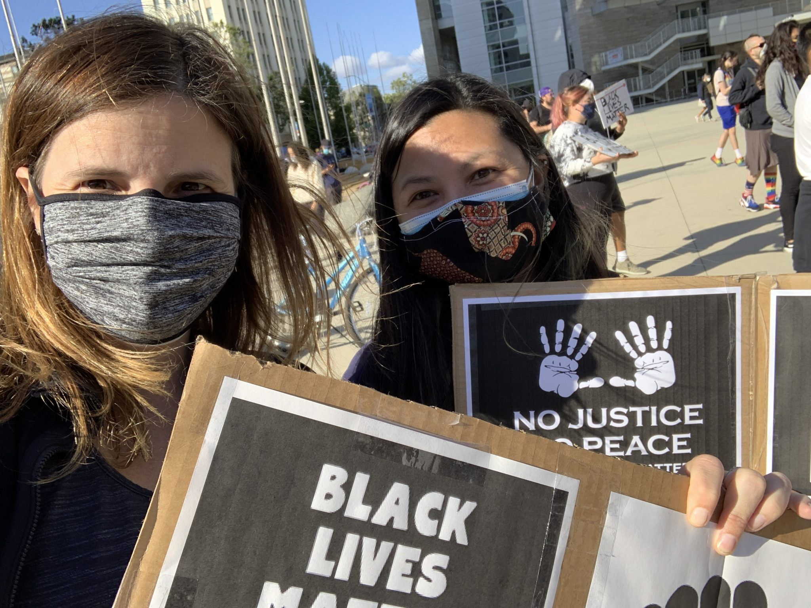

These are crazy times we are living in. I won't rehash current events here, I'm sure, like me, everyone is on media overload, but OMG, there's some seriously bad shit going on in this country.

I've been thinking a lot about how I can show support. I posted earlier with some ideas, and, after thinking about it, I've started doing stuff.

Today, my friend Robin and I went down to San Jose City Hall to join the Black Lives Matter protests. After the riots and looting last weekend, the protests this week have been pretty peaceful.

At work, our CEO is showing support by giving everyone a copy of _Biased: Uncovering the Hidden Prejudice That Shapes What We See, Think, and Do_ by Jennifer Eberhardt. So, I took it one step further, and organized a book club / discussion for my co-workers.

Personally, I chose to read _How to Be an Antiracist_ by Ibram X. Kendi. Some of my friends will also be reading as our monthly book club selection. It's the first time in at least a year that I've organized a book club discussion where more than 2 other people are interested.

These things are not much, but every little bit counts. If I can be a better person, if I can help others, that's something.

Oh, and Robin and I also stopped to assist an unconscious man on our way home from the protest. Seems he was high on oxy, felt dizzy, and passed out on the sidewalk. His friend was trying to drag him home and asked us for help. Along with other bystanders, we called 911. He came to shortly before the police and firemen arrived. These were actually the only police we saw today, and the two officers were very nice and respectful.
