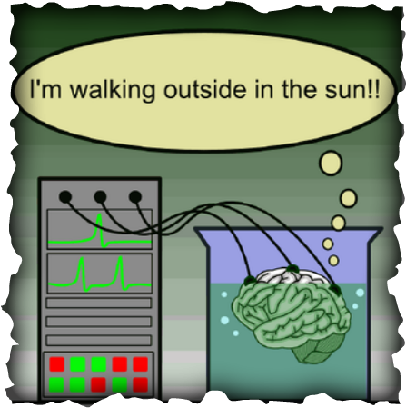

This week, the Perseid Meteor Shower hit its prime viewing peak. With a visibility estimate of 160-200 meteors per hour, I managed to see several shooting stars, although some of them were quite faint. Most of all, I enjoyed taking the time to appreciate nature and to unplug for a bit.

If you're a sciencey-type person, you can find more information about the Perseid Meteor Shower here. I find it fascinating that what we're watching is remnants of Comet Swift-Tuttle from 1862 or before. Since this is all happening trillions of miles away, it takes quite some time for it to be visible from Earth, even though it appears to be happening in realtime. I suppose it's all a matter of perspective.

Wednesday night, I lay in my hammock late at night, staring up at the night sky. I felt like an insignificant speck of dust, on a rock, lazily making its way through a vast, unknowable space. Is this not an accurate description? On a cosmic scale, humans, and one individual human at that, are just specks of dust.

Searching for shooting stars, wishing for a falling star, I kept coming back to this thought of insignificance.

As we sit on this 3rd rock from the sun, we often forget that we are orbiting the sun. We have a false perspective that we are stationary, and everything else is moving. The Earth is always moving, and it's taking us along with it.

When I think about the sheer enormity of the universe, it boggles my mind. It's already hard to worry about the typo in my email to someone important at work, the perceived criticism from a friend, the less than healthy food choices I made today. There is so much shit happening in the world today: a global pandemic that's killed almost a million people; a general state of unrest in the US due to police violence, racism, and politics; climate change; and a complete idiot who's running the country into the ground.

When set within the context of the universe as a whole, the cosmic insignificance of all these seemingly gigantic issues becomes clear. Does the sun care about racism? Does Comet Swift-Tuttle care if humans will be extinct—or not—on its next pass?

All of this has me thinking about philosophy, and that makes me think about Plato's Cave, which then causes me to think about the brain in a vat theory.

So, what's the point? Should we bury our heads in the sand and ignoring the problems in the world today? I don't think so. Suffering exists. It will always exist, but so too will the things that can alleviate it.

However, everyone can benefit from taking a step back, framing their perspective, and investing in determining what's truly important in their lives. I think someone famous once said "don't sweat the small stuff," and also "it's all small stuff."

On that note, I'll end with this. I'm working out what those important things are in my life, and on letting go of the small stuff. That, and I really want to spend more time learning about philosophy, I find it fascinating.
