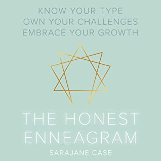

This was book 65 of the year for me, and the book that completed my goodreads.com reading challenge. I think, actually, that I need to adjust that goal to be a little higher. As of this writing, I'm sitting at 66 books done for 2020.

As for The Honest Enneagram, this is my first book on the subject (and probably not the last -- hello type 5 here!). At its core, the enneagram is a personality test (like Myers-Briggs). Answer a few questions, and get sorted into type categories. It's a bit like the Sorting Hat from Harry Potter! I will probably do a whole post just on my thoughts on the enneagram, but for now, I'll focus on this book.

First of all, I loved how the author breaks down each type into sections and discusses both the positives and negatives. She also does a great job with the quick summary of "just 3-4 things to keep in mind daily to be your best self."

This is a great "let's jump into the enneagram and learn about all the types" first book. However, it doesn't delve into the history or evolution of the enneagram at all, and I'm super interested to learn more about that.

The book presents the material in a very nice, positive light. The author talks about how she dislikes some of the common language often used in enneagram types, giving lazy as an example. She has reframed these to statements such as "tired after doing so much for others all day" instead of lazy. I think this is setting a good example; Many of us are hurting ourselves with negative self-talk, and type descriptions using words like lazy reinforces that.

Case states the goal is not to overcome our type pattern. Your type is part of who you are, part of your core being. It's not something to be changed or overcome. Learning about the enneagram is about being the best version of who you already are.

I listened to this on audible, and as an audiobook, I did find there were a few challenges. It can be hard to find specific content within an audiobook. A reference sheet would have been super useful. A simple PDF with a summary of the types and variants would suffice. It was really hard for me to keep a mental picture of all 9 types and their main characteristics and variants. The explanations of how your type pattern shifts during times of rest or stress were difficult to follow because of this. For example, during times of stress, type 4s go towards type 2. In order to understand this, I not only have to know about a type 4, but also a type 2.

I also really enjoyed the "bingo cards" for each type, but the full effect was missing in the audiobook presentation.

The one big negative for me that makes this a 3-star vs a 4-star book is the repetition. For each type, the author breaks down the type and her advice into the same sections. This is not inherently bad, but she reuses many of the same sentences for each of the 9 types. I would have preferred a fresh take on introducing the advice or really anything other than the repetition again and again (9 times).

★★★

_I received a free copy of this book from NetGalley, in exchange for a fair and honest review. This does not impact my opinion of the book or my review in any way_.
