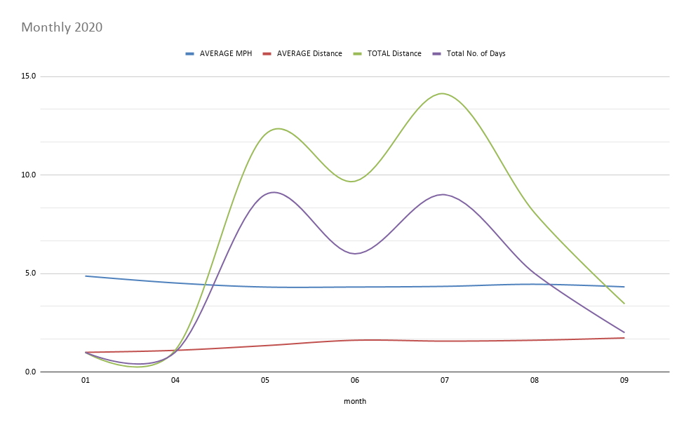
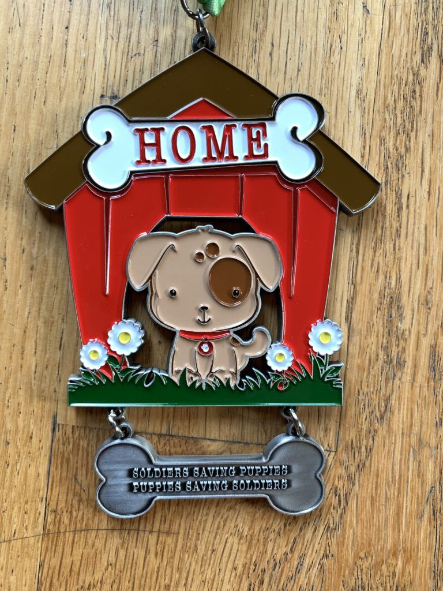

2020, the year we all stayed home and did nothing. Wait, nothing? There's plenty to do at home: eat, drink, complete puzzles, watch tv…get fat. Even though the gyms are closed, there are a lot of online options for workouts. For some reason, I don't find those very motivating most days, even the live zoom ones. And I miss running. Of course, here in California—with our current wildfire situation—running outside is not ideal due to the unhealthy air quality.

I'm fortunate enough to have a treadmill, so I've been taking advantage recently. I didn't run at all in 2018 or 2019, due to various injuries. Now, I'm taking it slow and building up a solid running base before attempting longer and faster runs.

I will probably always be a slow runner, and that's fine. What's important to me now is staying healthy and avoiding injuries. With the quarantine, I'm no longer going to the office, and thus no standing desk. Sitting all the time has been proven to be bad for your health, so this is one way I'm attempting to compensate.

My most immediate goal is to run 5k and then 10k. Hopefully, by the end of the year. Does anyone want to join me in training for a 10k?

<figure>

<figcaption>

Virtual race 10k medal for my mom, if she joins me!

</figcaption>

</figure>
