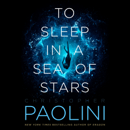

_To Sleep in a Sea of Stars_ is the latest novel by Christopher Paolini. In it, we meet Kira, our narrator, and main character.

Kira is a xenobiologist, stationed on a remote planet as part of a small crew. Their job? Getting the planet approved and ready to be colonized, and become one of the next human habitats. Something unexpected happens, and Kira loses her fiancé and all of her crewmates.

This is all pretty interesting, and I liked the world-building. However, the story is advancing at a snail's pace. After listening to about 9.5 hours of the audiobook, we reach a point where Kira has uncovered some amazing information and possibly a mini-climax in the novel. I feel that this could potentially have been the end of one story arc, making this book into a trilogy. However, there are 23 more hours to go in the audiobook.

I realized at this point, I just didn't care enough to invest that much more time listening. I can listen to several other books in that amount of time.

The writing is excellent and the narrator is great. I wanted to love this book. It's been a while since I've read a really great space opera, and I had high hopes for this one. Ultimately, though, the story is moving at such a slow pace that it didn't capture my attention enough to finish.

★★

Thanks to Macmillan Audio and Netgalley for a free copy in exchange for a fair and honest review.
